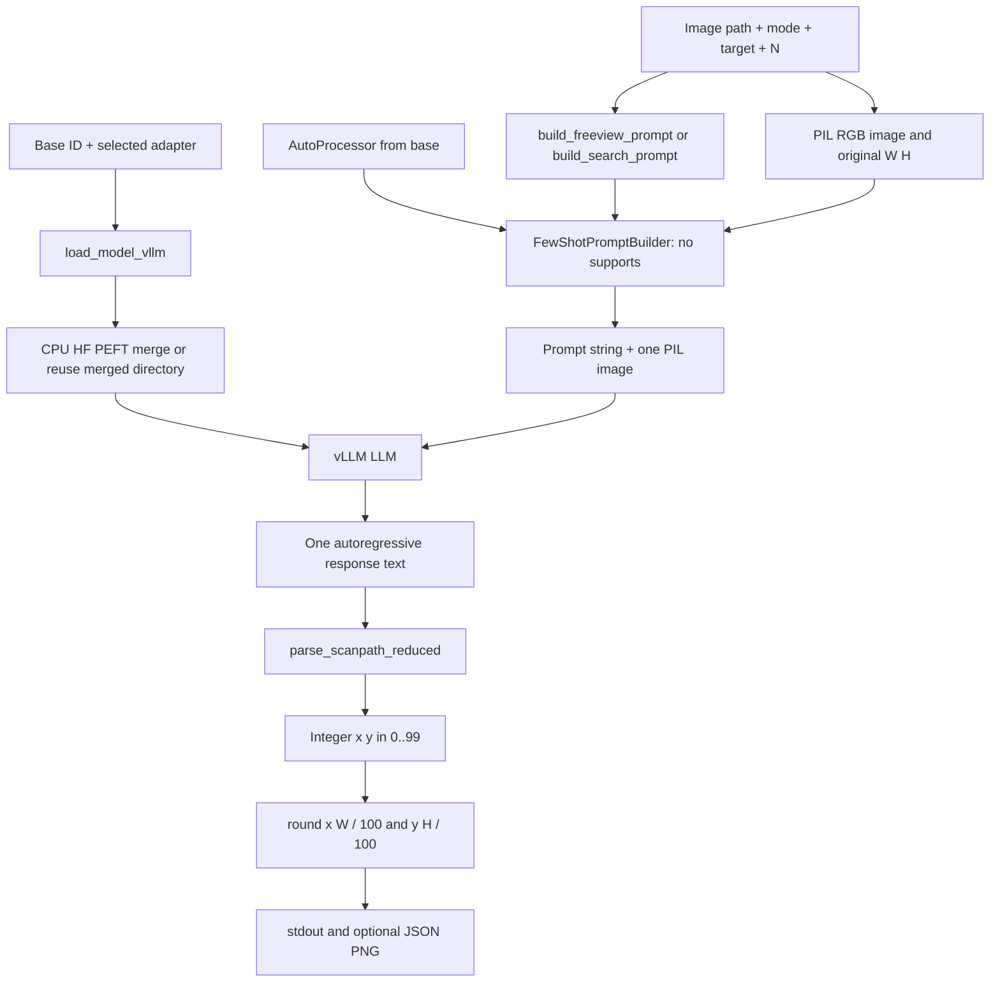
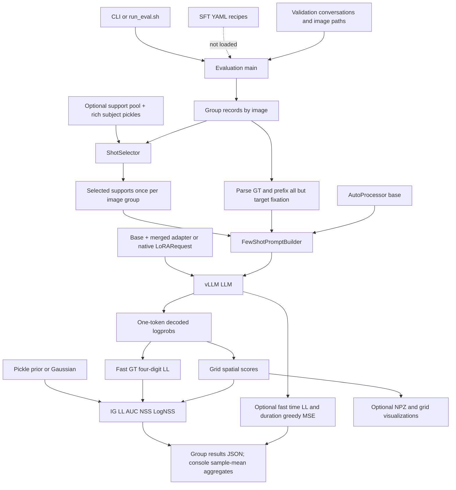
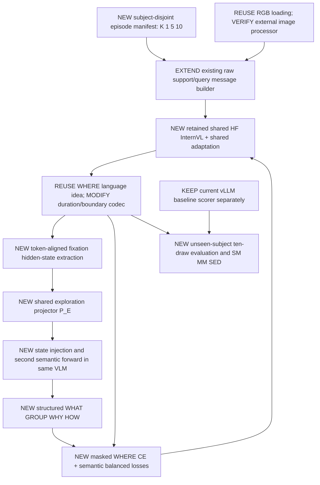

# DeepGaze3.5-VL Codebase Map

**Purpose:** source reference for building SemGaze without confusing the release with the proposed method. **Scope:** complete local checkout at `5cd84d2225beb92e77617b1ee5c5480cae948ab7`. No implementation changes accompany this map.

## 1. Executive summary and evidence standard

**CURRENT DEEPGAZE IMPLEMENTATION — VERIFIED:** principally **vLLM inference and conditional-likelihood evaluation**, with two PEFT LoRA adapters for `OpenGVLab/InternVL3_5-8B-HF`. Prediction generates an entire spatial scanpath in one autoregressive response. Evaluation mainly scores **ground-truth next fixations conditioned on ground-truth history**, not free-running predicted trajectories. Both scripts share the vLLM loader, prompt builder, and parser. There is **no separate HuggingFace prediction/chat pipeline**: HuggingFace loads a temporary CPU model to merge adapters. [`predict_scanpath.py:L30-L34,L207-L244`; `evaluate_vllm_unified.py:L2078-L2201,L2283-L2417,L2842-L3020`.]

Inputs are RGB images and textual tasks, optionally image/task/scanpath demonstrations in evaluation. Output coordinates are parsed to **0–99**, although prompts describe **0–100**. Prediction can convert to original pixels. It returns no duration or hidden state. Evaluation has timestamp/duration branches; this does not establish that either bundled adapter learned duration generation. [`predict_scanpath.py:L42-L73,L238-L265`; `evaluate_vllm_unified.py:L49-L172,L571-L659,L1455-L1696`.]

Key findings:
- **Multi-image few-shot context already exists**, including a `subjective` selector. However, evaluation selects supports once per **image group**, using the first sample's subject; other subjects inherit those supports. It is not a correct general same-subject episodic evaluator. [`evaluate_vllm_unified.py:L471-L526,L598-L632,L2774-L2779`.]
- **Bundled priors cannot resolve subjects**: only `centerbias` is stored, whereas subject lookup needs `image`, `subjects`, `fixations_x`, `fixations_y`. [Pickle metadata; `evaluate_vllm_unified.py:L248-L275`.]
- **Executable training is NOT PRESENT IN THIS REPOSITORY.** YAML SFT recipes exist but have no local consumer. There is no optimizer/backward loop, semantic pass, or fixation-hidden-state extraction. [Inventory below; §20 audit.]

**VERIFIED** means direct source/data/metadata evidence or a source-extracted helper check. **INFERRED** means an interpretation or likely intervention. **NOT PRESENT** means absent locally, not necessarily upstream. **UNCLEAR FROM REPOSITORY** means external code, missing records, or a model run is needed. Source paths are relative to `DeepGaze3.5-VL/`; line ranges refer to this revision. JSON keys/binary headers are references when lines are unsuitable. All future behavior is labeled **PROPOSED SEMGAZE EXTENSION**. No remote paper/model was used to fill local evidence gaps.

## 2. Complete repository inventory

Recursive discovery found **45 tracked release files**, plus nested Git metadata, and only **two Python files**. No nested AGENTS.md, symlinks/reparse points, training package, tests, base checkpoint, or merged checkpoint directory was present. This is a separate Git checkout inside the parent SemGaze workspace.

```text
DeepGaze3.5-VL/
├── .gitattributes
├── .gitignore
├── LICENSE
├── README.md
├── requirements.txt
├── run_eval.sh
├── predict_scanpath.py                       # 274 lines
├── evaluate_vllm_unified.py                  # 3,119 lines
├── configs/
│   ├── internvl3_5_8b_combined.yaml
│   └── internvl3_5_8b_visual_search.yaml
├── data/
│   ├── sample_MIT.json
│   ├── images/
│   │   ├── MIT_0985.jpg
│   │   ├── MIT_0986.jpg
│   │   ├── MIT_0987.jpg
│   │   ├── MIT_0988.jpg
│   │   └── MIT_0989.jpg
│   └── centerbias/MIT/
│       ├── 0985.pkl
│       ├── 0986.pkl
│       ├── 0987.pkl
│       ├── 0988.pkl
│       └── 0989.pkl
├── model/
│   ├── combined_adapter/
│   │   ├── adapter_config.json
│   │   ├── adapter_model.safetensors
│   │   ├── added_tokens.json
│   │   ├── chat_template.jinja
│   │   ├── merges.txt
│   │   ├── preprocessor_config.json
│   │   ├── processor_config.json
│   │   ├── special_tokens_map.json
│   │   ├── tokenizer.json
│   │   ├── tokenizer_config.json
│   │   ├── video_preprocessor_config.json
│   │   └── vocab.json
│   └── visual_search_adapter/
│       ├── adapter_config.json
│       ├── adapter_model.safetensors
│       ├── added_tokens.json
│       ├── chat_template.jinja
│       ├── merges.txt
│       ├── preprocessor_config.json
│       ├── processor_config.json
│       ├── special_tokens_map.json
│       ├── tokenizer.json
│       ├── tokenizer_config.json
│       ├── video_preprocessor_config.json
│       └── vocab.json
└── .git/                                   # infrastructure
```

| File/directory | Role, callers, dependencies, inputs/outputs |
|---|---|
| `predict_scanpath.py` | Image/mode/target/N CLI → stdout, optional JSON/PNG. Own symbols: `build_freeview_prompt`, `build_search_prompt`, `save_overlay`, `parse_args`, `main`. Imports evaluator's loader/builder/parser, hence its scientific/plotting dependencies too. |
| `evaluate_vllm_unified.py` | Shared model loading, serialization/parsing, subjects, shot selection, prompts, probing, metrics, centerbias, visualization; evaluation CLI. Validation/support JSON + images → scored JSON, optional NPZ/plots. §26 symbol index. |
| `run_eval.sh` | Bash wrapper invoking combined-adapter sample evaluation, changing to script directory first. |
| `configs/*.yaml` | Declarative SFT recipes; no executable consumer locally. |
| `data/sample_MIT.json` | 75 annotated records, five images, 15 records/image; not generated predictions. |
| `data/images/*.jpg` | Actual JPEGs, each 1024×768, 8-bit, three components (header inspection). |
| `data/centerbias/MIT/*.pkl` | Five dictionaries containing only 768×1024 float32 log-density; 3,145,908 bytes each. |
| `model/*` | LoRA weights and tokenizer/processor artifacts; not complete InternVL models. |
| `README.md` | Usage/provenance claims; source wins on disagreement (§31). |
| `requirements.txt` | Eleven package pins; comment says tested with Python 3.12. |
| `LICENSE` | Local notice states non-commercial research use for code and explicitly names combined adapter; base model/data have separate terms. Search adapter not explicitly named in clause 1. This reports the notice, not an upstream legal interpretation. |
| `.gitattributes` | LFS for safetensors, pickles, both tokenizer JSON files. |
| `.gitignore` | `eval_output/`, `*_merged/`, `__pycache__/`, `*.pyc`, `.DS_Store`; arbitrary output directories not generally ignored. |

### Every checkpoint artifact

Both directories inspected independently. SHA-256 comparisons found all files except adapter config/weights **byte-identical between adapters**.

| Filename (each directory) | Combined bytes | Search bytes | Meaning |
|---|---:|---:|---|
| `adapter_config.json` | 1,088 | 1,087 | PEFT metadata consumed by adapter loader. |
| `adapter_model.safetensors` | 349,251,312 | 87,368,144 | Materialized LoRA payload, not LFS pointer; §8. |
| `added_tokens.json` | 913 | 913 | 36 token-to-ID mappings. |
| `chat_template.jinja` | 481 | 481 | Stored role/image template; not explicitly selected by mains. |
| `merges.txt` | 1,671,853 | 1,671,853 | BPE merges, 151,388 lines including header. |
| `preprocessor_config.json` | 732 | 732 | Image processing metadata. |
| `processor_config.json` | 72 | 72 | InternVLProcessor, image sequence length 256. |
| `special_tokens_map.json` | 877 | 877 | EOS/pad/image/video roles. |
| `tokenizer.json` | 11,424,484 | 11,424,484 | BPE graph: 151,643 base vocabulary entries, 151,387 merges, 36 added tokens. |
| `tokenizer_config.json` | 7,641 | 7,641 | Qwen2Tokenizer, length 40960, token roles. |
| `video_preprocessor_config.json` | 804 | 804 | Video settings; unused in application. |
| `vocab.json` | 2,776,833 | 2,776,833 | Matches tokenizer JSON's base vocab. |

No base `config.json`, `generation_config.json`, model Python, vision/projector checkpoint, training log, optimizer/scheduler state or dataset registry is bundled. Safetensors metadata only identifies `format: pt`.

Recursive `.git/` inventory contains config/description/FETCH_HEAD/HEAD/index/packed-refs, info/exclude, refs/reflogs, one pack/index pair, sample hooks and LFS hooks. Eight LFS objects correspond to two weights, five priors and shared tokenizer content. These are storage, not extra model/source files; hooks were not executed.

Potential generated artifacts, **absent initially**: `<adapter>_merged/`, evaluation output directories, `unified_<fast|grid>_<K>shot_<timestamp>.json`, `grids/sample_<idx:05d>.npz`, `scanpath_comparisons/*.png`, `fixation_heatmaps/*.png`, caller-named prediction JSON/overlay. [`evaluate_vllm_unified.py:L2161-L2168,L2371-L2376,L2710-L2734,L2882-L2890,L2032-L2035`; `predict_scanpath.py:L255-L270`.]

## 3. Entrypoints

### Actual call chains

```text
run_eval.sh: set -euo pipefail; cd script directory
 -> evaluate_vllm_unified.py::main
    -> resolve_adapter_path [if adapter]
    -> load validation JSON / detect tuple format
    -> load_model_vllm -> optional merge_lora_adapter -> vllm.LLM
    -> AutoProcessor(base) -> FewShotPromptBuilder -> SaliencyComputer
    -> optional pool / build_subject_index / ShotSelector
    -> per-image group: RGB image, centerbias, supports, GT parser
       -> grid: compute_multi_scanpath_distributions -> four digit phases
       -> fast: score_coordinates -> four digit phases
                + optional timestamp/duration scoring/prediction
    -> group JSON -> console aggregates -> optional grid visualization

predict_scanpath.py::main
 -> parse_args -> choose N/adapter -> build_freeview_prompt OR build_search_prompt
 -> Image.open.convert(RGB) -> shared load_model_vllm(num_images=1)
 -> AutoProcessor(base) -> FewShotPromptBuilder(no supports, empty partial)
 -> SamplingParams -> llm.generate(one request)
 -> first output text -> parse_scanpath_reduced -> original pixels
 -> stdout / optional JSON / save_overlay
```

Evidence: `run_eval.sh:L5-L20`; `predict_scanpath.py:L170-L274`; `evaluate_vllm_unified.py::main`. No other application entrypoints.

### Prediction CLI (complete)

Source: `predict_scanpath.py:L122-L167,L175-L188`.

| Argument | Default/requirement | Effect |
|---|---|---|
| `--image` | Required | Input path. |
| `--mode` | `freeview`; or `search` | Prompt/default adapter/default N. |
| `--target` | None; nonempty required for search | Literal target; unknown categories warn. |
| `--num-fixations` | None → 8 freeview / 3 search | Prompt and token budget, not enforced output length. |
| `--adapter-path` | None → script-relative combined/search adapter | Override passed unchanged, no checkpoint-root resolution. |
| `--base-model` | `OpenGVLab/InternVL3_5-8B-HF` | Model/processor source. |
| `--temperature` | 0.0 | Prediction sampling. |
| `--seed` | 42 | Prediction SamplingParams seed. |
| `--max-model-len` | 4096 | Context cap. |
| `--max-num-seqs` | 32 | Engine concurrency. |
| `--gpu-memory-utilization` | 0.90 | Memory fraction. |
| `--output` | None | JSON path; parent not created. |
| `--save-overlay` | None | PNG path; parent not created. |

No flags for YAML, native LoRA, quantization, supports, duration, hidden states, or tensor parallelism. Search warning list, case-sensitive: `bottle, bowl, car, chair, clock, cup, fork, keyboard, knife, laptop, microwave, mouse, oven, potted plant, sink, stop sign, toilet, tv` (`predict_scanpath.py:L76-L81,L190-L201`).

### Evaluation CLI (complete)

Source: `evaluate_vllm_unified.py:L2424-L2519` and downstream main.

| Argument | Default | Effect/caveat |
|---|---|---|
| `--base-model` | `OpenGVLab/InternVL3_5-8B-HF` | Loader/processor. |
| `--adapter-path` | None | Base-only when omitted; otherwise resolve/merge. |
| `--merge-only` | false | Exits only merged-adapter branch; vLLM import and val JSON load occur first. |
| `--use-native-lora` | false | Unmerged vLLM LoRA request. |
| `--quantization-bit` | None | Native-adapter branch: 4/8 both request bitsandbytes; bit width not separately forwarded. |
| `--val-json` | Required | Also required for merge/verify. |
| `--images-dir` | `/mnt/lustre/work/bethge/bkr710/projects/lvlm-gaze/llamafactory_data_scanpath_v2_lodo` | Image root; override locally. |
| `--output-dir` | `eval_unified_outputs` | Created before model load. |
| `--num-shots` | 0 | K; image allowance K+1. |
| `--shot-pool-json` | None | Required with K>0. |
| `--shot-pool-max` | 500 | Shuffle/truncate except subjective; 0 disables. |
| `--shot-strategy` | random | random, random-fixed, diverse, same-dataset, subjective. |
| `--metric-mode` | fast | fast or grid. |
| `--pkl-dir` | `/mnt/lustre/work/bethge/bkr710/projects/deepgaze-iccv/tmp_datasets_withsubj` | Prior/subject lookup; omission is not None. |
| `--centerbias-alpha` | None → 0 | Positive grid augmentation; ignored by fast scoring. |
| `--max-samples` | None | Truthy slice after detection/model loading; 0 leaves all. |
| `--resolution` | 100 | Grid/prior size; coordinates remain 0–99. |
| `--batch-size` | 384 | Prompt chunking, not all grid phases. |
| `--max-model-len` | 4096 | Context cap. |
| `--max-num-seqs` | 256 | Concurrency. |
| `--tensor-parallel-size` | 1 | vLLM parallelism. |
| `--gpu-memory-utilization` | 0.95 | Wrapper uses 0.90. |
| `--enforce-eager` / `--no-enforce-eager` | false | Eager flag; help describes disabling CUDA graphs. |
| `--skip-viz` | false | Suppress grid plots. |
| `--num-viz-samples` | 10 | Plot selection count. |
| `--save-grids` | false | Grid NPZs. |
| `--resume-json` | None | Reuse old results/file; no compatibility checks. |
| `--seed` | 42 | Python/NumPy/selector, not evaluation engine/SamplingParams. |
| `--verify-only` | false | Full load/pool/index then up to three prompt builds; no generation. |
| `--skip-temporal` | false | Disable timestamp handling. |
| `--skip-durations` | false | Disable duration handling. |
| `--temporal` | false | Force four-digit timestamp mode. |
| `--durations` | false | Force three-digit durations, mutually exclusive with temporal. |

`normalize_digits=True` and `log_z=0.0` are hard-coded **not CLI flags** (`L2510-L2511`). Prefix caching=true and max native rank=64 are loader defaults not CLI controls. No source reads environment variables. YAML placeholders are not expanded here.

## 4. Configuration system

**VERIFIED:** neither script imports YAML, opens either recipe, or accepts `--config`. All YAML keys below have **no executable consumer in this release**. Meanings describe intended settings, not a verified external trainer. “LlamaFactory” in `prepare_shot_examples`/CLI help supports an **INFERENCE** of external-framework recipes, not a bundled training integration (`evaluate_vllm_unified.py:L639,L2443`).

C = `configs/internvl3_5_8b_combined.yaml`; V = `configs/internvl3_5_8b_visual_search.yaml`.

| Key | Meaning/intended effect | C value | V value | Consumed by |
|---|---|---|---|---|
| `model_name_or_path` | Base model | `OpenGVLab/InternVL3_5-8B-HF` | same | None locally |
| `trust_remote_code` | External model code | true | same | None locally |
| `stage` | Training stage | sft | same | None locally |
| `do_train` | Training enabled | true | same | None locally |
| `finetuning_type` | Adaptation method | lora | same | None locally |
| `lora_rank` | Low-rank dimension | 32 | 8 | None locally |
| `lora_alpha` | LoRA scaling | 64 | 16 | None locally |
| `lora_dropout` | LoRA dropout | 0.05 | same | None locally |
| `lora_target` | Projection targets | `q_proj,k_proj,v_proj,o_proj,gate_proj,up_proj,down_proj` | same | None locally |
| `dataset_dir` | Dataset location placeholder | `${DATASET_DIR}` | same | None locally |
| `dataset` | Training aliases | `scanpath_train_MIT,scanpath_train_CAT,scanpath_train_COCO,scanpath_train_Daemons,scanpath_train_Figrim` | `scanpath_search_train` | None locally |
| `eval_dataset` | Validation aliases | `scanpath_val_MIT,scanpath_val_CAT,scanpath_val_COCO,scanpath_val_Daemons,scanpath_val_Figrim` | `scanpath_search_val` | None locally |
| `template` | External template name | intern_vl | same | None locally |
| `cutoff_len` | Training length cap | 2048 | same | None locally |
| `preprocessing_num_workers` | Preprocess workers | 16 | same | None locally |
| `dataloader_num_workers` | Loader workers | 4 | same | None locally |
| `output_dir` | Output placeholder | `${OUTPUT_DIR}` | same | None locally |
| `logging_steps` | Log interval | 10 | same | None locally |
| `save_strategy` | Save schedule | steps | epoch | None locally |
| `save_steps` | Save interval | 1000 | absent | None locally |
| `plot_loss` | Plot request | true | same | None locally |
| `overwrite_output_dir` | Overwrite request | true | same | None locally |
| `save_only_model` | Save only weights | false | same | None locally |
| `report_to` | Reporting | none | same | None locally |
| `load_best_model_at_end` | Restore best checkpoint | true | same | None locally |
| `metric_for_best_model` | Best-model metric | eval_loss | same | None locally |
| `greater_is_better` | Metric direction | false | same | None locally |
| `per_device_train_batch_size` | Per-device batch | 4 | same | None locally |
| `gradient_accumulation_steps` | Accumulation | 4 | same | None locally |
| `learning_rate` | Learning rate | 1.0e-4 | same | None locally |
| `num_train_epochs` | Epochs | 10.0 | same | None locally |
| `lr_scheduler_type` | LR schedule | cosine | same | None locally |
| `warmup_ratio` | Warmup fraction | 0.1 | same | None locally |
| `bf16` | Training precision | true | same | None locally |
| `ddp_timeout` | Distributed timeout | 180000000 | same | None locally |
| `per_device_eval_batch_size` | Validation batch | 1 | same | None locally |
| `eval_strategy` | Validation schedule | steps | epoch | None locally |
| `eval_steps` | Validation interval | 1000 | absent | None locally |

Evidence: model/method in both YAMLs `L4-L15`, data `L17-L24`, C output/train/eval `L26-L54`, V `L26-L52`. C header says **Rank 16**, but actual YAML/adapter rank is **32**; its “at each epoch” comment disagrees with step evaluation. Recipes are not proof of completed run settings, epochs, batch size, or best checkpoint.

Other configuration: adapter metadata controls PEFT; saved processor/tokenizer metadata is inspected in §§7–10 but mains request the **base** processor. No dataset registry resolves training aliases. Runtime hard-codes coordinate maximum 99, two-digit format, default comma-space separator, time widths, logprob count 20, missing logprob -20, first-fixation exclusion, and prediction token budget `max(64,16*n+16)`.

## 5. Dependencies and runtime

| Package | Pin | Source-visible use |
|---|---|---|
| vllm | 0.11.2 | LLM, SamplingParams, optional LoRARequest; all generation. |
| transformers | 4.57.6 | AutoProcessor; AutoModelForImageTextToText for merge; alternate Gemma branch checks version. |
| peft | 0.18.1 | PeftModel loading/merge, no training. |
| torch | 2.9.0 | FP16 CPU merge, CUDA cache cleanup; no training forward. |
| numpy | 2.2.6 | Grids, metrics, RNG, NPZ. |
| scipy | 1.16.1 | ndimage.zoom and special.logsumexp. |
| pillow | 11.3.0 | RGB image loading. |
| matplotlib | 3.10.6 | Agg plotting, including predictor overlay. |
| tqdm | 4.67.3 | Progress. |
| accelerate | 1.12.0 | Listed, no direct import or launcher locally. |
| safetensors | 0.7.0 | Listed, checkpoint format; no direct source import. |

Evidence: `requirements.txt:L1-L12`; imports in both scripts; `evaluate_vllm_unified.py:L2078-L2082,L2142-L2168,L2318-L2328`. No direct torchvision/pysaliency/ScanMatch/MultiMatch/edit-distance dependency. AUC's comparison comment is not a pysaliency call. Bitsandbytes is optionally requested by string but is **not explicitly listed**. HuggingFace download/cache/authentication is delegated; no custom environment variables or hub calls.

README/shell require a GPU. Merge explicitly uses `torch_dtype=torch.float16, device_map="cpu"`. Engine receives tensor parallel size (default 1), memory fraction, image/context/concurrency caps, prefix caching and eager flag. **No engine dtype, explicit device, attention implementation/backend, or engine seed is set.** YAML BF16, saved adapter F32, and CPU merge FP16 are distinct facts. Native branch requests bitsandbytes for either 4 or 8 without forwarding an explicit bit width; actual resulting quantization is external behavior, not established here. [`evaluate_vllm_unified.py:L2283-L2417`; `README.md:L58-L60,L112-L114`.]

There is no CPU inference fallback, OOM retry, context-budget planner or truncation policy. Bash is required for the wrapper; Windows compatibility is not established locally. This audit's Python was 3.13.2, not the declared tested 3.12; PIL, SciPy, matplotlib, vLLM and PEFT were unavailable. Model smoke tests were not run; no packages/base weights downloaded.

## 6. Model architecture and loading

```text
base ID: OpenGVLab/InternVL3_5-8B-HF
  default adapter branch:
    AutoModelForImageTextToText.from_pretrained(base,
      torch_dtype=float16, trust_remote_code=True, device_map="cpu")
      -> external config/backbone (vision -> projector -> causal LM internals)
      -> PeftModel.from_pretrained(model, adapter_path)
      -> merge_and_unload -> save_pretrained(adapter_path + "_merged")
      -> AutoProcessor(base).save_pretrained(merged_path)
      -> delete temporary model / gc / empty_cache
      -> vllm.LLM(model=merged_path, ...)
  no adapter: vllm.LLM(model=base, ...)
  native adapter: vllm.LLM(model=base, enable_lora=True, ...)
                  + LoRARequest("finetuned_adapter", 1, adapter_path)

main separately loads AutoProcessor(base, trust_remote_code=True)
  -> apply_chat_template(tokenize=False)
  -> prompt + PIL image(s) to vLLM -> external tokenization/vision processing
  -> llm.generate
```

Evidence: `evaluate_vllm_unified.py:L2078-L2201,L2283-L2417,L2606-L2625`; `predict_scanpath.py:L207-L235`.

**Exact configured model:** InternVL **3.5**, **8B**, **HF-format `-HF`**. No local custom DeepGaze model class. Base revision is **not pinned** (`revision:null` in adapters; no revision argument in loading). Exact external config/model/code bytes on a future first download are therefore **UNCLEAR FROM REPOSITORY**.

| Component | Local evidence / boundary |
|---|---|
| Backbone config | External from_pretrained/vLLM; no full config.json bundled. |
| Tokenizer | AutoProcessor supplies tokenizer; saved artifacts say Qwen2Tokenizer/BPE. No AutoTokenizer call. |
| Vision model | External InternVL; no constructor, model class, feature shape or code locally. |
| Multimodal projector | External; no projector implementation or adapter tensors. |
| Language model | Weight names reference `base_model.model.model.language_model.layers.0..35`; adapter shapes expose dimensions. A Qwen2 tokenizer does **not** establish precise LM architecture/version. |
| Adapter | Seven attention/MLP projection pairs per LM layer; merged by default. |
| Generation | vLLM LLM.generate; no Transformers generate/chat call. |
| System message | None constructed by builder; saved template adds none. External runtime template must still be verified. |

Other name-dispatched merge branches recognize Qwen, Gemma3, SmolVLM, PaliGemma, LLaVA (`evaluate_vllm_unified.py:L2103-L2153`). They are infrastructure, not bundled/tested models. Gemma rope-scaling patch and hf_config_path do not apply to InternVL.

### Merge/cache and checkpoint resolution

Existence of `<adapter_path>_merged` alone causes reuse: no content/hash/base/tokenizer/completeness check. Changed adapter or base can silently reuse stale weights. Evaluation calls `resolve_adapter_path`; prediction does not. Resolver accepts checkpoint-prefixed paths directly; otherwise scans checkpoint children, reads minimum `eval_loss` entry in `trainer_log.jsonl`, uses `current_steps`, chooses nearest checkpoint at/before that step (earliest if none), or latest when no scores. No such logs/children bundled. [`evaluate_vllm_unified.py:L2204-L2280,L2369-L2386`; `predict_scanpath.py:L181-L188,L208-L215`.]

Merge saves **base processor**, not adapter-local processor. Mains also request base processor. Evaluation comment “actual loaded model path” disagrees with `processor_model=args.base_model`; SaliencyComputer retries engine path only when processor is None (`L689-L702,L2164-L2168,L2606-L2625`). Future token additions must propagate deliberately through tokenizer, model embeddings, saved merge, processor and engine; dropping a tokenizer beside an adapter is insufficient.

## 7. Tokenizer, special tokens and chat protocol

Both saved tokenizers use NFC, regex Split then ByteLevel, and BPE. Numeric regex alternative is **`\p{N}`**, one number character. Vocabulary/merge counts are in §2. Digits 0–9 have IDs **15–24**. Config: `add_bos_token=false`, `add_eos_token=false`, `bos_token=null`, `unk_token=null`, `padding_side=right`, `model_max_length=40960`, `clean_up_tokenization_spaces=false`. [Both adapter `tokenizer.json`, `tokenizer_config.json`, `vocab.json`.]

| Saved token | ID | Role |
|---|---:|---|
| `<|endoftext|>` | 151643 | Pad, not configured EOS. |
| `<|im_start|>` | 151644 | Message start. |
| `<|im_end|>` | 151645 | Message end and tokenizer EOS. |
| `` | 151669 | Image start. |
| `</img>` | 151670 | Image end. |
| `<IMG_CONTEXT>` | 151671 | Template image placeholder/context. |
| `<video>` | 151678 | Video marker, unused locally. |

Other added mappings cover object references, boxes/quads, vision/image/video padding, tool calls/responses, FIM, repo/file separators and think markers; exact IDs in `added_tokens.json`. **No fixation/duration/subject/WHERE/END_FIX-specific token exists.** “Added tokens” is artifact terminology, not proof those tokens were introduced by gaze training. Source never calls add_tokens/add_special_tokens/resize_token_embeddings. No embedding/head weights in adapters.

Read-only local tokenization with saved tokenizer:

```text
text: [(05, 06), (70, 80)]
tokens: ["[(", "0", "5", ",", "Ġ", "0", "6", "),", "Ġ(",
         "7", "0", ",", "Ġ", "8", "0", ")]"]
IDs: [9697,15,20,11,220,15,21,701,320,22,15,11,220,23,15,7252]
```

`Ġ` is tokenizer space display. `(05,06,250)<END_FIX>` ends in tokens `")<", "END", "_FIX", ">"`, not an atomic boundary token. Thus a fixed `)` token ID is not a safe fixation boundary. This verifies saved artifacts, not equality with the downloaded base tokenizer.

The builder applies `processor.apply_chat_template(messages, tokenize=False, add_generation_prompt=True)` and appends `partial_response` afterward (`evaluate_vllm_unified.py:L623-L632`). It adds no system, subject ID, support index or explicit query label. Saved `chat_template.jinja` renders each message as `<|im_start|>{role}\n{content}<|im_end|>\n`, each image content item as `<IMG_CONTEXT>\n`, each video as `<video>\n`, and the final prefix as `<|im_start|>assistant\n`. Text is inserted unchanged. Both string and typed-content-list messages are handled. This exact stored-template behavior is locally rendered in §11; mains load the base template, so the final expanded LM tokens are an external boundary.

## 8. Adapter analysis

| Property | Combined | Visual search |
|---|---|---|
| Base | OpenGVLab/InternVL3_5-8B-HF | same |
| peft_type / task_type / version | LORA / CAUSAL_LM / 0.18.1 | same |
| r / lora_alpha / dropout | 32 / 64 / 0.05 | 8 / 16 / 0.05 |
| Target set (different list order only) | self_attn.q_proj, self_attn.k_proj, self_attn.v_proj, o_proj, gate_proj, up_proj, down_proj | same |
| bias / lora_bias | none / false | same |
| modules_to_save / trainable_token_indices | null / null | same |
| inference_mode / init_lora_weights | true / true | same |
| use_dora / use_qalora / use_rslora | all false | same |
| alpha_pattern / rank_pattern | empty objects | same |
| fan_in_fan_out / ensure_weight_tying | false / false | same |
| revision / layers_pattern / layers_to_transform / layer_replication / target_parameters / exclude_modules | null | same |
| Other metadata | auto_mapping, alora_invocation_tokens, arrow_config, corda_config, eva_config, megatron_config null; loftq_config empty; qalora_group_size=16; megatron_core=megatron.core | same; not evidence these algorithms were active |
| Header bytes | 75,496 | 74,184 |
| Tensor count / dtype | 504 / all F32 | 504 / all F32 |
| Stored scalar parameters | 87,293,952 | 21,823,488 |

Evidence: each `adapter_config.json` and safetensors JSON header, safely read using the first eight-byte header length; tensors were not decoded. Metadata is only `format:pt`.

All weight names start `base_model.model.model.language_model.layers.` and end `.lora_A.weight` or `.lora_B.weight`, covering layers **0–35** and seven modules: `mlp.down_proj`, `mlp.gate_proj`, `mlp.up_proj`, `self_attn.k_proj`, `self_attn.o_proj`, `self_attn.q_proj`, `self_attn.v_proj`. 36×7×2=504. No vision/projector/embedding/output-head/subject/semantic weights in these payloads.

| Projection per layer | A shape | B shape |
|---|---|---|
| q_proj / o_proj | [r,4096] | [4096,r] |
| k_proj / v_proj | [r,4096] | [1024,r] |
| gate_proj / up_proj | [r,4096] | [12288,r] |
| down_proj | [r,12288] | [4096,r] |

**VERIFIED as repository claims:** README says combined was trained jointly on MIT/CAT/COCO/Daemons/Figrim free viewing and is a best checkpoint; search on COCO-Search18 target-present/absent trials. YAML aliases/ranks align; mode picks adapter (`README.md:L5-L25`; `predict_scanpath.py:L175-L201`). These are not independently verified run records.

**INFERRED:** adapters alter LM WHERE generation via attention/MLP weights, rather than a separate coordinate head. This follows weight names, CAUSAL_LM metadata, prompts and text generation. Exact training splits, subject exposure, achieved metrics, selection history, and learned duration capability remain **UNCLEAR FROM REPOSITORY**.

Default loading is PEFT from_pretrained → merge_and_unload → vLLM. Alternate evaluation uses native LoRARequest forwarded by all SaliencyComputer generation methods. Prediction ignores the loader's second return, but does not request native LoRA, so its current adapter is not lost. No per-subject adapter selection exists. [`evaluate_vllm_unified.py:L787-L791,L821-L825,L857-L861,L2155-L2162,L2322-L2367`; `predict_scanpath.py:L208-L215`.]

## 9. Input data contract

### 9.1 Bundled JSON: actual schema and content

`data/sample_MIT.json` is a list of **75 records**. Every record has exactly `conversations` and `images`. Every conversation has exactly `from` and `value`; each record contains human then gpt turns and exactly one image. There are 15 records each for MIT_0985–0989; the first is MIT_0987. All answers are spatial pairs, no temporal triples. Across all records: **617 fixations**, length 1–13, x range 4–90, y range 14–99. Each prompt's requested count matches its answer length. Two records have only one fixation, so normal evaluation skips them; expected scorable records=73 and transitions=617−75=542, assuming no other failures. [Full read-only JSON inspection; skip/scoring loop `evaluate_vllm_unified.py:L2797-L2800,L2927-L2951`.]

| Field | Type | Required/meaning | Consumption and transformation |
|---|---|---|---|
| Root | list[object] | Required validation/support collection | json.load; first-five format detection; optional slicing/grouping. |
| `images` | list[str] | At least one path required | Only `[0]` loaded; joined to images_dir. Selector overlap exclusion considers all listed paths. |
| `images[0]` | str | Query/support image path | RGB loading; basename identifies dataset/index for prior/subject lookup. |
| `conversations` | list[object] | At least two turns required | Position 0 task, position 1 GT; extra turns ignored. |
| `conversations[0].from` | str (`human`) | Present in sample, not consulted | Actual builder sets role `user` independently. |
| `conversations[0].value` | str | Required task/prompt | `.replace("<image>", "").strip()` removes all textual image markers. |
| `conversations[1].from` | str (`gpt`) | Present, not consulted | Builder uses role `assistant` for supports. |
| `conversations[1].value` | str | Required scanpath target | Query: parsed as spatial/triple GT. Support: raw response inserted unchanged. |
| `_subject` | tuple(dataset, int ID) | NOT in sample JSON | Added in memory by build_subject_index; used for support selection, never put into prompt. |

Evidence: `data/sample_MIT.json:L1-L16`; `evaluate_vllm_unified.py:L286-L300,L340-L346,L389-L419,L639-L657,L2783-L2800`. No JSON schema validation; missing keys/empty lists/wrong types can fail. Required here means indexing demands it, not a validator enforces it.

No standalone sample field for target, task ID, subject ID, dimensions, centerbias, N, duration, timestamps, dataset identity or trial condition. Task, viewing interval and N are embedded in prose; GT length is parsed from answer. Dataset is inferred from filename. Duration/timestamp variants live in a third tuple element, not separate fields. Prediction's separate CLI target/N do not imply those JSON fields exist.

First real GT (`data/sample_MIT.json:L8-L10`):

```text
[(53, 48), (72, 32), (38, 54), (41, 59), (19, 64), (56, 86), (76, 92), (76, 41)]
```

### 9.2 Data paths and dataset identity

```text
JSON record -> positional conversations / images[0]
 -> images_dir / images[0] -> PIL RGB image
 -> task string with literal <image> removed
 -> optional support image/task/raw answer turns
 -> processor chat template -> prompt string + image(s) -> vLLM
```

`extract_dataset_from_image_path` recognizes only `MIT`, `CAT`, `CAT2000`, `COCO`, `Daemons`, `Figrim`, splitting filename stem at the final underscore. `_image_to_pkl_path` maps CAT2000→CAT and rejects unknown dataset prefixes. Centerbias lookup has its own mapping but lets unknown prefixes pass through as directory names. Thus “supports COCO” is not evidence of a complete native COCO-Search18 annotation loader. Search data must already be converted to this conversation format. [`evaluate_vllm_unified.py:L212-L245,L1713-L1755`.]

Subject lookup expects richer pickles: `image` shaped C×H×W, parallel arrays `subjects`, `fixations_x`, `fixations_y`. It groups by subject while preserving array order, converts coordinates, and matches the full query GT trajectory. Exact match or match after dropping the first pickle fixation is accepted (latter warns). First matching subject wins; ambiguity is not checked. No match raises ValueError. Lookup uses the **query's GT scanpath** to discover identity; this is not a deployment-ready subject contract. Missing converter named in comment (`convert_to_v2_scanpath.py`) is **NOT PRESENT**. [`evaluate_vllm_unified.py:L248-L354`.]

## 10. Image preprocessing and coordinate conventions

### 10.1 What source actually does

Prediction: `Image.open(args.image).convert("RGB")`, then `W,H=img.size` (`predict_scanpath.py:L203-L205`). Evaluation: same RGB conversion per unique query image; supports each use first path and RGB conversion, skipping unreadable support images with a warning (`evaluate_vllm_unified.py:L646-L657,L2752-L2758`). No local resize, center crop, manual tiling, dynamic_preprocess function, thumbnail construction, PIL-to-tensor conversion, pixel normalization, or processor tensor call occurs before requests. Local shape is **PIL width×height**, not a visible tensor shape.

vLLM receives `multi_modal_data={"image": image}` for one image or `{"image": [support_1,...,support_K,query]}` for multiple. Corresponding image placeholders are in the same order (`evaluate_vllm_unified.py:L598-L632`). Vision preprocessing and token expansion happen inside external processor/engine code. The scripts do **not** load adapter-local preprocessor JSON directly.

### 10.2 Saved processor metadata, not guaranteed runtime behavior

Both `preprocessor_config.json` files say:
- `processor_class: InternVLProcessor`, `image_processor_type: GotOcr2ImageProcessorFast`.
- `do_convert_rgb`, `do_resize`, `do_rescale`, `do_normalize`: true; `data_format: channels_first`.
- `size: {height:448,width:448}`, `resample:3`, `rescale_factor:0.00392156862745098` (1/255).
- mean `[0.485,0.456,0.406]`, std `[0.229,0.224,0.225]`.
- `crop_to_patches:false`, `min_patches:1`, `max_patches:12`, `default_to_square:true`.
- `crop_size`, `do_center_crop`, `do_pad`, `pad_size`, `device`, `disable_grouping`, `input_data_format`, `return_tensors`: null.

If those normalization settings are used, the implied channel transform is `(pixel/255−mean[channel])/std[channel]`; a channels-first 448×448 RGB item has shape 3×448×448. Neither the actual batch/patch tensor shape nor this runtime choice is observable in local calls. `processor_config.json` has `image_seq_length:256`. **Do not assert 12 tiles plus a thumbnail:** crop_to_patches is false in saved metadata, no thumbnail flag/algorithm is supplied, and the runtime processor comes from the external base. Actual aspect-ratio selection, tile ordering/count, thumbnail behavior, vision token count and resize-to-token mapping are **UNCLEAR FROM REPOSITORY**.

Video metadata is also inspected: `InternVLVideoProcessor`, 384×384, mean `[0.48145466,0.4578275,0.40821073]`, std `[0.26862954,0.26130258,0.27577711]`, RGB/resize/rescale/normalize true, `do_sample_frames:false`, `initial_shift:true`, `return_metadata:false`, other frame-count/fps/crop/pad fields null. Neither script accepts video. No image preprocessing difference is locally implemented between combined and search modes.

### 10.3 Coordinate spaces and exact conversions

| Space/conversion | Formula / contract | Source |
|---|---|---|
| Original image | W columns, H rows; all samples W=1024,H=768 | PIL `.size`; JPEG headers |
| Prompt coordinates | x=horizontal, 0 left/100 right; y=vertical, 0 top/100 bottom | `predict_scanpath.py:L49-L51,L66-L68` |
| Serializer | `f"{int(round(max(0.0,min(99.0,value)))):02d}"` | `evaluate_vllm_unified.py:L49-L52` |
| Spatial parser | Unsigned integer regex; `min(int(x),99)`, `min(int(y),99)` | `evaluate_vllm_unified.py:L110-L134` |
| Prediction pixels | `(int(round(x/100.0*W)), int(round(y/100.0*H)))` | `predict_scanpath.py:L240-L244` |
| Evaluation overlays | `(x/resolution*W, y/resolution*H)` as floats | `evaluate_vllm_unified.py:L1893-L1897,L1977-L1984` |
| Subject pickle pixels→grid | `int(round(float(round((xi/img_w)*100,1))))`, likewise y/H | `evaluate_vllm_unified.py:L259-L274` |
| Metric array addressing | grid[y,x]; indices clamped to 0..resolution−1 | `evaluate_vllm_unified.py:L1769-L1774,L2873-L2875` |
| Prior original→grid | exp(logprior−max), bilinear zoom by `(R/H,R/W)`, divide sum, clip ≥1e−10, log | `evaluate_vllm_unified.py:L1741-L1749` |

Grid is zero-based by array use; no one-based correction. The original dataset pixel indexing convention is not stated. Formatter rounds after clipping; pickle conversion uses **two-stage rounding and no clipping**. Thus pickle-derived 100 can fail to match JSON parsed as 99. Prediction divides by **100**, not 99 or W−1: `(53,48)` on 1024×768 becomes `(543,369)`; `(99,99)` becomes `(1014,760)`, not the last pixel. No mapping through resized image/patch coordinates is implemented. Normalized [0,1] is only an intermediate arithmetic fraction, not model text. `--resolution` does not rescale GT values; use 100 to match current serialization.

## 11. Exact prompt construction

### 11.1 Free viewing and search

Exact free-viewing text for N=8 (`predict_scanpath.py:L42-L56`):

```text
Analyze this image and predict a human eye movement scanpath during free viewing for 3 seconds.
A scanpath is the temporal sequence of fixation points showing where a person looks over time.
Consider visual saliency, semantic importance, and how attention naturally flows across a scene.

Generate a scanpath of exactly 8 fixation points in temporal order as a list of tuples: (x, y)
- x: horizontal position (0-100, 0=left, 100=right)
- y: vertical position (0-100, 0=top, 100=bottom)
- Points should be ordered from first fixation to last fixation.

Output ONLY a Python list of tuples:
[(51,46),(38,28),...]
```

Exact search text for target=laptop, N=3 (`predict_scanpath.py:L59-L73`):

```text
Analyze this image and predict a human eye movement scanpath while searching for a laptop.
A scanpath is the temporal sequence of fixation points showing where a person looks over time.
Consider the search target, visual saliency, and how attention naturally flows during visual search.

Generate a scanpath of exactly 3 fixation points in temporal order as a list of tuples: (x, y)
- x: horizontal position (0-100, 0=left, 100=right)
- y: vertical position (0-100, 0=top, 100=bottom)
- Points should be ordered from first fixation to last fixation.

Output ONLY a Python list of tuples:
[(51,46),(38,28),...]
```

The text ends at `...]`, with no trailing newline from the helper. N is inserted without positivity checking. Search always uses the article `a`; no target normalization. Source comment says copied verbatim from training data; only freeview can be checked against bundled sample data, not absent search training data.

Evaluation **does not choose these functions or an adapter-specific prompt**. It uses each JSON task string after removing `<image>` and stripping outer whitespace. Adapter selection does not rewrite the task. The first sample's cleaned task equals the freeview N=8 text above. Prompts for temporal/search data must be supplied by the annotation author. [`evaluate_vllm_unified.py:L643-L644,L2783-L2787`.]

### 11.2 Effective role framing and partial assistant prefix

For one query, the builder constructs exactly this message object, not a system/user string pair:

```python
[{"role":"user", "content":[
    {"type":"image"}, {"type":"text", "text":test_prompt}
]}]
```

Applying the **stored template** yields (TASK is the exact text above; placeholder is explanatory, not literal):

```text
<|im_start|>user
<IMG_CONTEXT>
TASK<|im_end|>
<|im_start|>assistant
```

Few-shot example rendered and checked locally with the stored Jinja template:

```text
<|im_start|>user
<IMG_CONTEXT>
SUPPORT TASK<|im_end|>
<|im_start|>assistant
[(01, 02)]<|im_end|>
<|im_start|>user
<IMG_CONTEXT>
QUERY TASK<|im_end|>
<|im_start|>assistant
[(
```

Here `SUPPORT TASK`/`QUERY TASK` were test strings, and `[(` was the supplied partial response. `mm_data={"image":[support_image,query_image]}`. Real supports use raw GT responses; scoring appends formatted GT history such as `[(53, 48), (`. No explicit end-of-support token, subject token, persistent embedding or query metadata is inserted. [`evaluate_vllm_unified.py:L577-L659,L2927-L2937`.]

**Boundary:** these are exact local helper/template reconstructions. Runtime calls the **base AutoProcessor**; equality of its template with the adapter artifact and its expansion into repeated vision tokens cannot be proven from this checkout. The precise literal user task and message ordering are verified; final image-expanded token IDs are not.

## 12. WHERE / scanpath representation

### 12.1 Spatial serialization

Current primary fixation is `(x,y)` (no index, duration, fixation token or semantic label). Trajectory is bracketed tuples, e.g. real sample in §9. `format_scanpath_reduced` emits zero-padded values with comma-space: `[(05, 06), (70, 80)]`. Partial formatter emits an **unfinished** trajectory ending `, (` or `[(`. It can append a supplied partial next coordinate. [`evaluate_vllm_unified.py:L49-L107`.]

Prompt example has no spaces, real GT uses spaces and not consistent zero-padding, scoring reconstructs two-digit padded numbers, and separator detection selects comma-space or comma. These are distinct formats. The “Python list” is only a textual convention: zero-padded `05` is not a valid ordinary Python decimal literal, and the implementation uses regex, not eval/literal_eval.

No learned numeric regression head or geometric grid-token vocabulary is visible. Digits are language tokens. For a generated pair, ordinary punctuation separates x/y, `)` closes a tuple, comma separates tuples, and `]` conventionally closes the list. There is **no `<END_FIX>`**, custom stopping criterion, or explicit stop-at-`]` enforcement. Generic engine EOS or max_tokens can stop before/after the requested number. N is supplied in the prompt but output count is not validated or truncated. No intrinsic maximum fixation count is declared. [`predict_scanpath.py:L228-L250`; tokenizer §7.]

### 12.2 Time-bearing branches

| Variant | Text | Formatter | How selected / supported |
|---|---|---|---|
| Spatial | `(05, 06)` | Two digits, clamp 0..99 | Both predictors' prompts and all bundled records. |
| Temporal | `(05, 06, 0250)` | Timestamp clamp 0..9999, 4 digits | `--temporal` or first-five detection; source labels onset timestamps in ms. |
| Duration | `(05, 06, 250)` | Duration clamp 0..999, 3 digits | `--durations` or detection; source labels fixation duration in ms. |

Detection inspects up to five records: if any contains triples with **all matched third fields of width 4**, temporal wins globally; otherwise analogous width 3 selects durations. It does not verify all records or units. Mixed-width/truncated/padded conventions can misclassify. Explicit force flags are mutually exclusive; skip flags then disable their mode. [`evaluate_vllm_unified.py:L127-L172,L2538-L2563`.]

`parse_scanpath_temporal` serves both triple formats and leaves the third integer unbounded. `parse_scanpath_reduced` drops the third component. Prediction always uses the spatial parser, so even generated triples lose duration. Fast evaluation scores time digits conditional on GT x/y and history; duration mode additionally greedily predicts three duration tokens. Grid main path uses spatial history only, even with detected temporal/duration data. No bundled time-annotated example or duration-specific adapter exists; joint free-running `(x,y,duration)` skill is **UNCLEAR**, not established by these helper methods.

### 12.3 Full representation chain

```text
Provided support answer string -> unchanged assistant turn -> external tokenizer
Query task + optional supports -> vLLM autoregressive response -> text
 -> parse_scanpath_reduced -> list[(int x,int y)] -> optional original pixels

GT answer -> parser -> format_partial_scanpath_reduced(history)
 -> assistant prefix -> token logprob probing for next GT digits
 -> scalar LL / grid (not a differentiable training target)
```

There is no source path serializing training examples into labels or a CE mask. Existing “teacher forcing” means inference-time prefix conditioning, not teacher-forced training.

## 13. Autoregressive generation

| Call | Parameters explicitly set | Behavior |
|---|---|---|
| Prediction `llm.generate` | temperature CLI (default 0), `max_tokens=max(64,16*n+16)`, seed CLI | One response containing all fixations; first request/first output text only. |
| `generate_with_logprobs` / batched variant | max_tokens=1, logprobs=20 by default, temperature=0 | One-token distribution, decoded token string→float logprob. |
| `generate_batched_greedy` | max_tokens=3 default, temperature=0 | Used for duration text. |
| `generate_model_samples` | max_tokens=7, temperature=1 default, n=num_samples, logprobs=0 | Coordinate samples from prefix; **not called by main**. |
| `sample_scanpath_from_model` | Starts (50,50), loops N−1; grid probabilities; visualization passes temperature=0.8 | Iterative NumPy spatial sampling, not one-shot text generation. |

References: `predict_scanpath.py:L228-L236`; `evaluate_vllm_unified.py:L767-L862,L1187-L1262,L1836-L1875,L2059-L2062`. No top-p, top-k, beams, repetition penalty, stop strings, stop token IDs, ignore_eos or custom stopping class is configured. Do not silently substitute assumed library defaults. Saved tokenizer EOS is §7; engine/model generation configuration is external. No finish reason or truncation diagnostic is retained.

Default predictor is requested greedy; changing temperature requests stochastic sampling. Eval probes are requested greedy but collect distributions. NumPy/Python are seeded in main; selector owns random.Random(seed). Eval SamplingParams/engine do not receive that seed. Bitwise reproducibility across engine/hardware is not proven. Visualization advances RNG and can reselect different supports. A decoded response is not iteratively fed back through a Python fixation loop in prediction.

## 14. Output parsing, validation and fallbacks

Exact spatial regexes (`evaluate_vllm_unified.py:L110-L124`):

```python
pattern_3 = r'\((\d+),\s*(\d+),\s*\d+\)'
pattern_2 = r'\((\d+),\s*(\d+)\)'
```

First collect triples; **if any exist, return only those**, dropping third fields. Otherwise collect pairs. x/y clamp only upper bound to 99; regex requires unsigned digits. No bracket verification, whitespace cleanup, prose stripping, JSON parsing, length enforcement, duration validation, first-fixation check, retry or fallback scanpath. Triple parser is `r'\((\d+),\s*(\d+),\s*(\d+)\)'`, with third component int unchanged (`L127-L134`).

| Input/problem | Actual outcome |
|---|---|
| `Example (1, 2), answer [(3, 4)]` | Both pairs accepted, including prose example. |
| `[(1,2),(3,4,005)]` | Only `(3,4)`; valid pair silently discarded. |
| `[(100,999)]` | `(99,99)` silently clipped. |
| `[(-1,2),(1.5,2)]` | No matches; negative/decimal coordinates not parsed. |
| `[( 1,2)]` | No match; no whitespace allowed after opening parenthesis. |
| `[(01,02), (03,` | Returns first complete pair, ignores truncated tail. |
| `(1,2)` | Accepted without list brackets. |
| `[(10,20,999)]` | Spatial result `(10,20)`; triple parser preserves 999. |
| NaN/inf/negative duration | Triple fails; there is no numeric sanitization branch. |
| Too many/few fixations | Prediction reports actual length but accepts it. |
| No matches / empty EOS response | Prediction prints/saves empty arrays; evaluator skips GT with <2 fixations. |

These examples were exercised with the exact source-extracted parser functions, without importing/running the model. No error is raised merely for malformed generated text.

Duration greedy parser inspects **first three characters**, retains digit characters there, takes three if present, right-pads a shorter digit string with zeros, or returns 0 if none; it prints a warning count. Thus `"25"→250`, not 25; leading whitespace/punctuation can change the result. It is not equivalent to parsing a validated duration token sequence (`evaluate_vllm_unified.py:L1677-L1696`). Model-sample helper instead anchors exactly two digits + detected separator + two digits after strip, drops nonmatching samples, and does not require a closing parenthesis (`L1247-L1260`).

## 15. Center bias

All five protocol-4 pickles were inspected using pickle opcode metadata and raw float payloads, **without executing pickle deserialization**. Each has only `centerbias`, little-endian float32, shape (768,1024), 786,432 finite values. Approximate ranges/sums:

| File under data/centerbias/MIT | min log density | max log density | sum(exp(values)) |
|---|---:|---:|---:|
| 0985.pkl | −28.004133 | −11.701600 | ~1.000000000 |
| 0986.pkl | −28.003990 | −11.701419 | ~1.000000001 |
| 0987.pkl | −28.004335 | −11.701342 | ~1.000000001 |
| 0988.pkl | −28.004230 | −11.701287 | ~0.999999999 |
| 0989.pkl | −28.004152 | −11.701155 | ~1.000000000 |

They are distinct per-image priors at original sample resolution. How they were estimated, which subjects/split contributed, and whether held-out data was excluded are **UNCLEAR FROM REPOSITORY**. No prior-estimation script exists.

Lookup: `DATASET_index.jpg → <pkl-dir>/<mapped dataset>/<index>.pkl`. Missing/unparseable/unreadable prior returns None; main falls back to synthetic Gaussian centered `(R/2,R/2)`, sigma=20 grid units, normalized with logsumexp. Loaded prior undergoes exp→bilinear zoom→normalize→clip≥1e−10→log; it is **not renormalized after clipping**. [`evaluate_vllm_unified.py:L1703-L1755,L2657-L2670,L2760-L2772`.]

**No centerbias enters the VLM prompt or single-image prediction.** Default evaluation uses it only as the IG baseline. Grid mode optionally adds `alpha*center_bias` in log-space and adjusts scores when alpha>0; fast mode ignores alpha. Visualization samples model grids without this augmentation. Rich subject pickles share the lookup root but require extra keys absent from bundled priors. Actual runtime loader uses `pickle.load`; only trusted files should be supplied because deserialization is executable behavior. This audit did not execute those pickles.

## 16. End-to-end single-image prediction trace

**CURRENT DEEPGAZE IMPLEMENTATION.** Concrete example: `--image data/images/MIT_0987.jpg`, default freeview, N=8. No validation JSON or centerbias is loaded.

1. `parse_args()` validates only mode/required image/required search target through argparse and the explicit target check. No N positivity/image existence validation yet (`predict_scanpath.py:L122-L167`).
2. `main()` selects N=8 and script-relative combined adapter; generates exact freeview text (§11). Search instead defaults N=3 and search adapter, with a category warning (`L173-L201`).
3. Pillow opens/converts image to RGB; records `(W,H)=(1024,768)` for this asset. No image tensor is constructed in local code (`L203-L205`).
4. Shared `load_model_vllm(...,num_images=1)` uses default tensor parallel 1, prefix cache true, eager false, with CLI length/concurrency/memory settings. Existing merge reused or CPU HF+PEFT merge generated; engine instantiated (`L208-L215`; loader §6).
5. Base `AutoProcessor` is loaded, independently of engine; `FewShotPromptBuilder(processor)` stores it (`L217-L219`).
6. Builder constructs one user message, one image item, one task text item; no supports, empty partial assistant text. Returns a **str** and **dict containing one PIL image**; applies template with generation prefix (`L221-L226`; evaluator `L577-L632`).
7. `SamplingParams(temperature=0.0,max_tokens=144,seed=42)` for N=8. Engine receives a Python list of length one with keys `prompt` and `multi_modal_data`; internal image/token tensor dimensions are not exposed (`L229-L235`).
8. Take `out[0].outputs[0].text`, discarding other metadata including finish reason/token IDs/logprobs. One autoregressive response generates the whole requested path (`L235-L236`).
9. Regex parse to list of pairs, shape conceptually `(M,2)` with arbitrary M≥0, each integer 0..99. No requirement M=N (`L238`).
10. Scale each pair by original W/H, round to integer pixels; still M pairs. No resized-space conversion or duration preservation (`L240-L244`).
11. Print mode, optional target, requested/generated counts, original dimensions, grid/pixels. Optional JSON fields exactly `mode`, `target`, `num_fixations` (requested), `image`, `scanpath_grid`, `scanpath_pixels`. Tuples become JSON arrays. Raw response and dimensions are **not saved** (`L246-L266`).
12. Optional `save_overlay` uses Agg, original aspect/size, cyan path, red unfilled fixation circles, yellow one-based labels; plots all returned pairs and saves. Labels are rendering annotations, not model fixation indices (`L90-L115,L268-L270`).

No `torch.no_grad`/`inference_mode` context is locally needed/used around an HF forward because the local prediction API is vLLM, not a retained Torch model. No trainable feature tensor returns to application code.

## 17. End-to-end evaluation pipeline

### 17.1 Startup and grouping

1. Parse/validate CLI (§3), hard-code digit normalization and log_z=0, resolve adapter checkpoint, seed NumPy/Python, create output directory (`evaluate_vllm_unified.py:L2424-L2530`).
2. Read entire validation JSON, detect temporal/duration format before max-sample slicing, apply force/skip flags (`L2532-L2563`).
3. Instantiate shared vLLM loader with max images **K+1**, then base AutoProcessor, builder and SaliencyComputer. Processor failure warns and sets None; SaliencyComputer retries engine model path, but if both fail no useful fallback builder exists (`L2591-L2625,L689-L702`).
4. Apply validation limit; load pool for K>0. Non-subjective pool can be shuffled/truncated; subjective indexes every pool/validation record from rich pickles and ignores pool max. Create seeded selector (`L2630-L2652`).
5. Create synthetic baseline and detect prior root; establish effective alpha. Verify-only, if selected, builds up to three prompts after all preceding work and returns without generation (`L2657-L2703`).
6. Create timestamped result path; optionally read old results, then write current config and existing results. Group all selected validation records by **images[0]**, not subject/task; derive completed indices (`L2710-L2745`).
7. Per image: skip only if **all** its record indices are completed; open RGB once; load prior once; select supports once using **first record**; load support images (`L2747-L2779`).
8. Clean each task; parse GT pairs and optional triples; skip paths shorter than 2; initialize result dictionaries. All valid records in the group are processed, including previously completed members if the group was only partially resumed (`L2781-L2829`).
9. Run grid or fast scoring below, append/save the entire successful group. Group exception prints traceback and skips that group; startup failures are not under this catch (`L2842-L3055`).
10. Print mean/std of per-sample metric means, optionally visualize grid results, write final JSON. Aggregate summary numbers are **not separately serialized** (`L3068-L3115`).

### 17.2 Few-shot selection: existing functionality and limits

| Strategy | Actual selection logic | Caveat |
|---|---|---|
| `random` | Exclude any pool record sharing test image; keep first record per image; sample min(K,unique images). | Silently returns fewer than K; first-record deduplication is not subject-balanced. |
| `random-fixed` | Sample once from entire pool, cache/reuse. | Deliberately bypasses test-image exclusion: possible query leakage. |
| `same-dataset` | Prefer same recognized filename dataset, deduplicate images, fill remaining from other datasets. | Falls back to random for unknown dataset; not strict same-dataset if insufficient. |
| `diverse` | Group by recognized dataset or unknown, deduplicate, shuffle, round-robin sorted dataset names. | Dataset diversity, not same-subject personalization. |
| `subjective` | Require index and `_subject`; choose same `(dataset,subject_id)`, exclude test images, deduplicate by longest parsed path, require K unique images, sample. | Raises for insufficient subjects/images; outer generic empty-candidates case can return empty first. Main grouping misapplies first subject's shots to the rest. |

Evidence: `evaluate_vllm_unified.py:L361-L564`. `prepare_shot_examples` skips unreadable support images without replacement, so effective K can drop further. Results `shot_images` reflects **selected records**, whereas `num_shots` counts successfully loaded examples; the two can disagree (`L635-L659,L2808-L2816`).

Subject resolver's mutable default pickle cache persists within process; `_subject` is Python metadata only. Subject selection itself uses raw support examples, not SE-Net, subject tokens, persistent embeddings, per-subject adapters or test-time training. The **mechanism** is compatible with the stated SemGaze direction, but episode identity, query/subject grouping, held-out split and K coverage need modification.

### 17.3 Fast mode: conditional GT digit likelihood

For each scanpath with L fixations, build **L−1** assistant prefixes containing GT fixations `[:i]`, i=1..L−1. First fixation is given, never scored. Target GT x/y and optional third field are recorded. Time/duration mode includes third fields in previous-history formatting. Supports and query image are shared across that sample's transitions (`L2914-L2951`).

Separator is detected once per SaliencyComputer: probe after x digits, accept merged comma-space if present among top logprobs, otherwise compare a space token versus maximum single-digit logprob after comma. Cache globally; it is not checked anew per adapter task/sample. Existing base history strings built **before** detection are not rebuilt, so the first scored prefixes may retain comma-space even if comma is selected (`L723-L765,L2958-L2967`).

`score_coordinates(...,mc_coords=[])` scores only GT locations, not MC samples. For each target:

```text
log P(x,y | history,image,task,supports)
  ~= log P(x_tens | prefix)
   + log P(x_ones | prefix,x_tens)
   + log P(y_tens | prefix,x_tens,x_ones,separator)
   + log P(y_ones | prefix,x_tens,x_ones,separator,y_tens)
```

Each phase calls one-token vLLM generation and inspects top 20 logprobs. Digit tokens only count if decoded text length is exactly one and in ASCII 0–9. Phases deduplicate relevant prefixes; absence of a required earlier digit means later prefix queries can be omitted. Raw missing target terms use **−20 each**. Normalization subtracts logsumexp over ten digits at each queried prefix (`L1264-L1453`). Separators/parentheses/list closure/EOS likelihoods are **not scored**, so this is not full-sequence token CE or unrestricted text likelihood.

`_extract_digit_logprobs` fills missing normalization digits with minimum of **all** returned token logprobs, or −20 for an empty dict. Target extraction in score_coordinates still uses its own −20 fallback, not the same fill. This is an approximation when top-20 omits digits; the helper comment's blanket “conservative” guarantee should not be assumed for every final assembled likelihood (`L179-L205,L1438-L1447`). `log_z=0` is then subtracted (no effect); IG compares with prior. Centerbias alpha is not used here (`L2963-L2991`).

Temporal mode: four more normalized digit terms given GT x/y and prior history. Duration mode: three terms plus three-token greedy duration prediction and squared error against GT. Both exclude the first fixation; neither samples a free-running spatial+duration path (`L2993-L3020`).

### 17.4 Grid mode: spatial next-fixation distributions

`compute_multi_scanpath_distributions` flattens all image-group scanpaths' L−1 transitions, with offset bookkeeping. Four phases enumerate available x tens → x ones (up to 100 x) → y tens → y ones (up to 10,000 positions). Each cell is `[y,x]`; it begins at **−20.0**, and observed digit chains replace it with their raw sum. Missing coordinates retain −20, which can be greater than some genuinely scored low-probability cells. Phase 1 is one unchunked batch over all transitions; later phases in the multi helper chunk by batch_size. Separate single-transition visualization helper also leaves some phases unchunked (`L868-L1181`).

Unlike fast mode, **grid construction does not use per-digit normalization**, despite `normalize_digits=True` in main and README wording. Main applies:

```python
log_density -= min(0.0, logsumexp(log_density[valid_mask]))
if centerbias_alpha > 0:
    log_density += centerbias_alpha * center_bias
    log_density -= min(0.0, logsumexp(log_density))
```

Thus a grid with total mass below 1 is raised to unit mass; mass above 1 is **not** reduced. It is not unconditional normalization. Finite −20 placeholders make an entirely unobserved grid finite, often yielding a uniform fallback rather than an explicit failed prediction. Metrics then use that grid; NSS internally normalizes independently (`L2853-L2875`; §18).

Grid main uses **spatial pairs only**, not temporal/duration history/scoring, regardless of detected tuple format. Optional NPZ writes `grids` as float16 shape `(L−1,R,R)` when all transitions retained, `gt_fixations` as int16 `(L,2)`, and image string. No sampled prediction is scored by this path (`L2827-L2890`).

### 17.5 Results schema and aggregation

Output filename: `unified_{metric_mode}_{num_shots}shot_{YYYYMMDD_HHMMSS}.json`, unless resuming an existing file. Top-level keys: **config**, **centerbias_alpha**, **metric_mode**, **num_samples**, **results**. `config=vars(args)` includes hard-coded normalize_digits/log_z and resolved adapter path. JSON uses indent=2 and default=str. Saved after each complete image group and again at end (`L2710-L2736,L3046-L3049,L3114`).

| Result fields | Meaning |
|---|---|
| `idx`, `image`, `num_fixations`, `gt_fixations` | Validation-list index, path, parsed GT count and pairs. |
| `num_shots`, `shot_images` | Effective loaded shot count and selected image paths (potential mismatch on load failure). |
| `centerbias_source`, optional `centerbias_pkl` | data or synthetic, plus actual prior path. |
| Optional `is_temporal`, `gt_timestamps` | Full parsed timestamp sequence including first fixation. |
| Optional `is_durations`, `gt_durations` | Full parsed duration sequence including first fixation. |
| Grid `lp_mean_ig/auc/nss/log_nss/ll`, `lp_fixation_metrics` | Each fixation entry: `idx` (starts at 1), `target`, `ig`, `auc`, `nss`, `log_nss`, `ll`. |
| Fast `lp_mean_ig`, `lp_fixation_igs`, `lp_mean_ll`, `lp_fixation_lls`, `log_z` | L−1 transition scores. |
| Temporal `temporal_fixation_lls`, `temporal_mean_ll` | Conditional timestamp digit log-likelihood. |
| Duration `duration_fixation_lls`, `duration_mean_ll`, `duration_pred`, `duration_gt`, `duration_mse` | Duration scoring and prediction; pred/gt omit first fixation. |

Sources: `L2808-L2825,L2877-L2899,L2987-L3020`. There is **no generated WHERE trajectory, raw response, support subject ID, token IDs or hidden state in normal evaluation JSON**. Visualization predictions are rendered, not written as a prediction dataset. Aggregates use equal weight per sample mean, not equal weight per fixation/image/subject; `np.std` is population std, not standard error/confidence interval. Resume checks indices only and can mix settings or duplicate partially completed image groups (`L2714-L2722,L2745-L2750,L3068-L3100`).

## 18. Evaluation metrics

**Actually computed:** IG, LL; grid also AUC, NSS, LogNSS; fast optional temporal LL, duration LL, duration MSE and console RMSE. All definitions below come from source, not assumed standard-library versions.

| Metric | Implementation and input/preprocessing | Aggregation | Direction |
|---|---|---|---|
| Information Gain (bits/fixation) | `compute_information_gain` L1762–1775: `(model_log_grid[y,x]−baseline_log_grid[y,x])/ln(2)`; fast inline L2974–2985 from normalized digit LL. GT target after first fixation. | Transition mean per sample, then sample mean/std. | Higher |
| Spatial LL (natural log) | Grid L2873–2875 takes cell log score; fast `score_coordinates` sums four digit terms, normalizes each, log_z=0. Not punctuation/EOS likelihood. | Same two-level mean. | Higher |
| AUC | `compute_auc` L1778–1793: fraction of all grid cells lower than fixation value + half equal; all pixels, including target, serve in comparison. | Transition/sample means. | Higher |
| NSS | `compute_nss` L1796–1812: exp(grid−logsumexp), z-score target density over grid; zero if std=0. | Transition/sample means. | Higher |
| LogNSS | `compute_log_nss` L1815–1829: target log-score z-score across grid; zero if std=0. | Transition/sample means. | Higher |
| Temporal LL | `SaliencyComputer.score_temporal_gt` L1455–1556: four GT timestamp digits conditional on GT x/y/history; digit normalization. | Mean L−1 transitions/sample; sample mean/std. | Higher |
| Duration LL | `score_duration_gt` L1558–1642: three GT duration digits under same conditioning. | Same. | Higher |
| Duration MSE (ms²) | Main L3011–3020: mean `(greedy_pred−gt)^2`, excluding first. GT original third field can exceed formatter clamp. | Mean per-sample MSE, then sample mean/std. | Lower |
| Duration RMSE (ms) | Main L3097–3100: `sqrt(mean(sample_duration_mse))`; printed only. | Root of sample-weighted MSE, not pooled fixation-weighted RMSE. | Lower |

**NOT PRESENT:** ScanMatch (SM), MultiMatch (MM), String Edit Distance (SED), scanpath alignment, target-detection success/search efficiency, semantic WHAT/GROUP/WHY/HOW scores. No code or dependency invokes them. `lp_mean_nss_corrected` and `lp_mean_ms_nss` appear only in console aggregation of existing/resumed result keys; no current branch produces them, so they are **not implemented active metrics** (`L3079-L3087`). `generate_model_samples`/MC arguments are unused by main, not evidence of active Monte Carlo metrics.

Visualization is separate: `sample_scanpath_from_model` starts center `(50,50)` and samples N−1 grids, unlike prediction's generated first fixation. If no finite grid cells it appends center; otherwise renormalizes and NumPy-samples. Plots are selected evenly over IG-ranked results; supports can be reselected and differ from scoring. Heatmaps condition on GT history. These plots do not turn evaluation into free-running scanpath similarity measurement (`L1836-L2071`).

## 19. vLLM path versus HuggingFace path

The premise “prediction is HuggingFace, evaluation is vLLM” is **false in this checkout**.

| Property | predict_scanpath path | evaluation path | Actual HF-only path |
|---|---|---|---|
| API | vLLM LLM.generate | vLLM LLM.generate probes; NumPy sampling for visualization | AutoModelForImageTextToText for offline merge only |
| Loading | Shared load_model_vllm, one image | Same, K+1 images, more runtime flags | FP16 CPU from_pretrained; discarded after save |
| Adapters | Merged only through CLI | Merged or native LoRARequest, or none | PEFT from_pretrained/merge_and_unload |
| Preprocessing | RGB PIL; external engine processing | Same for query/supports | Saves base AutoProcessor, no image forward |
| Prompt | Local freeview/search helper | Record text + optional support turns + GT prefix | No chat/generation |
| Generation | One complete response | Conditional digit probes; duration tokens; optional spatial grid sampler | None |
| Hidden states | Not requested/returned | Not requested/returned; decoded logprobs only | Model object briefly exists but no forward/hook |
| Gradient graph available to caller | None exposed by this implementation | Python float/NumPy results; no Torch graph | No training path or retained model |
| Batching | One request | Chunked transitions/digit-prefix branches; shared image contexts | No data batches |
| Purpose | User-facing image→scanpath | Likelihood/saliency evaluation | Prepare checkpoint for inference |

Evidence: loader/generation/merge references in §§6,13,16–17. These statements concern **this implementation**, not a universal claim that no future vLLM release/API could expose features. For gradient-based SemGaze, current LLM.generate wrappers, logprob-to-float extraction, NumPy metrics and merged-model lifecycle cannot carry joint autograd. Keep them as baseline/evaluation tools; add a retained differentiable model path.

## 20. Training support audit

**Executable fine-tuning/training: NOT PRESENT IN THIS REPOSITORY.** Recursive source search for Trainer, training_step, backward, optimizer, AdamW, loss, labels, DataLoader, SFT, accelerate, deepspeed and torchrun found no trainer construction, training_step/backward call, optimizer, label tensor construction, loss computation, data loader or launcher. Only two Python files exist.

| Search family | What exists instead |
|---|---|
| Trainer / loss | `trainer_log.jsonl`, `eval_loss`, `current_steps` read by checkpoint resolver; no logs bundled and no trainer execution (`L2204-L2280`). |
| SFT / LoRA training | YAML declarations only (§4); PEFT inference merge (§8). |
| DataLoader | YAML `dataloader_num_workers`; no DataLoader class/use. |
| accelerate | Dependency pin only. |
| Teacher forcing | Formatted GT prefix supplied to inference API (§17), not differentiable training. |
| Training data pipeline | Conversations already provided; named converter/dataset registry/train sets absent. |

Metadata establishes saved low-rank tensors and intended recipe, not optimizer type, actual precision, effective distributed batch, completed epoch count, validation frequency achieved, training-label masking, loss scaling, trainable vision/projector policy, or subject-disjoint splits. Inference-mode metadata is not a training log. No per-user test-time training, per-subject adapters or persistent personalization embedding is implemented.

## 21. Hidden-state accessibility audit

**CURRENT DEEPGAZE IMPLEMENTATION:** no `output_hidden_states`, `return_dict_in_generate`, forward hook, direct model forward, `chat()`, hidden-state return, token-boundary mapper or h_t extraction exists. vLLM results are reduced to text or `{decoded_token: float_logprob}` (`predict_scanpath.py:L235-L236`; `evaluate_vllm_unified.py:L791-L799,L825-L835,L861-L862`). Those are not hidden-state tensors and cannot be differentiated through in this program.

| Question | Evidence-backed answer |
|---|---|
| Can current HF path request output_hidden_states=True? | It never calls a model forward/generate, so **not through a current CLI/path**. It constructs an AutoModelForImageTextToText object for merge; whether the externally resolved concrete model accepts/returns this option is **UNCLEAR FROM REPOSITORY** and must be tested before implementation promises. |
| What object would be the likely access point? | **INFERRED:** retain the HF multimodal model created at `merge_lora_adapter:L2146-L2151`, or load an equivalent unmerged PEFT model separately; inspect its multimodal forward and language-model outputs. Adapter names suggest `.model.language_model` within the backbone, but weight-key prefixes do not certify a Python access path after wrapping. |
| Does chat() hide required tensors? | No chat() call exists here. Do not redesign around an assumed InternVL chat wrapper; current barrier is vLLM result extraction and discarded HF object. |
| Direct forward needed? | **PROPOSED:** a teacher-forced multimodal forward over support/query plus WHERE target is the smallest likely differentiable experiment. Exact input/output kwargs and image-token alignment are external-model verification tasks. |
| Hidden states from generate()? | No HF generate call exists. A possible future `generate(...,output_hidden_states=True,return_dict_in_generate=True)` must be verified for this concrete class/version; its availability, shapes, last-token coverage, caching alignment and gradients are not established locally. Do not claim it is already supported by prediction. |
| Teacher-forced states easier? | **INFERRED engineering choice:** known target text yields deterministic boundary positions and a single sequence-level alignment problem, avoiding variable decoding-step caches. It still requires differentiable multimodal forward and correct masks, absent here. |
| vLLM equivalent now? | None exposed by these wrappers. No tensor graph/h_t reaches Python. This does not assert external impossibility. |
| Existing fixation boundary? | Ordinary closing tuple/list punctuation can merge into tokens (§7); no atomic END_FIX equivalent or boundary index exists. |

### Smallest likely intervention surface (PROPOSED, not implemented)

1. Reuse `FewShotPromptBuilder`'s support/query ordering and data preparation, but expose message/token alignment rather than only formatted string + PIL dict (`L577-L659`). Correct grouping to one subject/query episode and replace GT-matching identity lookup.
2. Add a **retained HF InternVL+PEFT loader/forward route** alongside `load_model_vllm`, using merge code as loading evidence but not automatically merging/discarding the trainable model (`L2078-L2201`). Validate concrete model API before building the trainer.
3. Reuse existing coordinate formatting tests; explicitly define a fixation boundary. Either map character spans to tokenizer positions (respecting merged punctuation) or introduce/tokenize/train a deliberate boundary token with complete tokenizer/embedding propagation. No such token is introduced in this task.
4. Teacher-force generated/GT WHERE text with the complete multimodal episode, request verified hidden-state output, select one h_t after the full fixation including duration/boundary, and test against token offsets. Decide predictive-state versus post-token-state indexing explicitly; next-token shifting can create off-by-one errors.
5. Retain Torch tensors for projection/semantic forward and loss. Do not route training through vLLM float-logprob/NumPy scoring.

This is not a one-line `output_hidden_states=True` edit to the existing prediction call. Multi-image prompt infrastructure is reusable; model execution and boundary alignment are the missing bridge. Exact hidden width from full model output, model class, feature layer choice, image embedding interface, and generate semantics remain verification gates. Adapter projection widths suggest 4096-wide LM activations but do not substitute for a runtime output contract.

## 22. SemGaze target contract (PROPOSED / NOT IMPLEMENTED AS A WHOLE)

The following is the supplied research target, **not a claim about current DeepGaze**:

```text
same-subject support image + task + scanpath demonstrations, K in {1,5,10}
 -> one shared InternVL-3.5-style causal multimodal VLM
 -> query WHERE as autoregressive scanpath language
 -> one hidden state per fixation boundary
 -> shared exploration-state projection P_E
 -> structured semantics: WHAT + noncontiguous GROUP + WHY + HOW
```

Personalization must come from **raw same-subject demonstrations in causal multimodal context**, not SE-Net, persistent user embeddings, subject-ID tokens as personalization, per-subject adapters, or test-time per-user fine-tuning. Current few-shot message construction already follows the raw-demonstration principle, but current grouping/identity resolution is not an adequate episode contract. Shared task adapters do not themselves violate the no-per-subject-adapter constraint.

Conceptual future fixation serialization is `(x,y,duration)<END_FIX>`. Current format is spatial `(x,y)` with ordinary punctuation, plus optional temporal/duration evaluation helper branches. Do not retroactively describe current outputs as this SemGaze format. Subject IDs may be needed in an episode manifest for data selection; they need not and should not become the personalization token. Proposed support/query split, h_t, P_E and semantic losses are not present now.

## 23. DeepGaze3.5-VL → SemGaze Gap Analysis

Status assesses readiness for the supplied SemGaze contract, not whether any superficially related helper exists. References identify the current evidence; missing features are supported by the complete source/training audit (§§2,20,21).

| Requirement | Classification | Current evidence and required work |
|---|---|---|
| InternVL-3.5 backbone | READY | Exact configured 8B-HF base and two compatible-recorded adapters; retain shared model (§6). Pin/verify actual revision before training. |
| Multimodal image input | READY | PIL→vLLM image(s), matching ordered placeholders; HF training tensor route still absent (§10). |
| Task/query conditioning | READY | Search/freeview text and arbitrary JSON task text (§11). |
| Scanpath language generation | READY | One-shot autoregressive text prediction (`predict_scanpath.py:L228-L238`). |
| Coordinate serialization | REQUIRES MODIFICATION | Reuse 0–99 codec, resolve 0–100 wording/padding/rounding and future duration grammar (§§10,12). |
| Duration generation | REQUIRES MODIFICATION | Conditional duration greedy/scoring exists; predictor discards third fields; bundled adapter skill UNKNOWN (§12). |
| Fixation delimiter | REQUIRES MODIFICATION | Ordinary punctuation only, merged token boundaries; no atomic boundary (§7). |
| Trajectory stopping | REQUIRES MODIFICATION | EOS/token cap delegated; prompt N not enforced; list-end not a stop (§13). |
| Support demonstrations | REUSABLE WITH SMALL CHANGE | Existing image/task/raw-answer turns; expose in prediction/HF route (`FewShotPromptBuilder`). |
| Multiple support images | READY | Builder supplies ordered list; evaluator permits K+1 images (`L598-L632,L2591-L2604`). Capacity still unverified. |
| Same-subject episodic input | REQUIRES MODIFICATION | Selector exists; query-GT matching, missing rich pickles and image-group bug prevent faithful general use (§17). |
| K=1/5/10 context | UNKNOWN | Arbitrary CLI K, but runtime 4096-token cap, no token budget planner; only five bundled unique images (§29). |
| Query/support separation | REQUIRES MODIFICATION | Turn ordering exists and most selectors exclude query image; random-fixed leaks, no task/subject split manifest (§17). |
| Requested fixation count N | REUSABLE WITH SMALL CHANGE | Supplied in prompt, bounded only indirectly by tokens; no output validation (§12). |
| Teacher-forced WHERE training | MISSING | Prefix conditioning is inference-only; no retained differentiable model/labels (§20). |
| WHERE token-level CE | MISSING | Digit-score metric is not full sequence CE or training loss (§17). |
| Fixation-boundary hidden-state extraction | MISSING | No hidden state return or boundary alignment (§21). |
| `<END_FIX>` equivalent | MISSING | Ordinary tuple punctuation is a delimiter, not a dedicated equivalent token (§7). |
| Shared exploration states | MISSING | No h_t→state path (§21). |
| Shared projector P_E | MISSING | No module/tensors/loss path locally. |
| Second semantic forward | MISSING | No WHAT/GROUP/WHY/HOW model pass. |
| Soft state injection into VLM embeddings | MISSING | No inputs_embeds/embedding splice code; external model interface UNKNOWN. |
| Structured JSON generation | MISSING | json.dump is file serialization, not semantic model output/grammar. |
| WHAT | MISSING | No semantic labels/targets/generation. |
| Noncontiguous GROUP | MISSING | No fixation-index grouping schema or target. |
| WHY | MISSING | No grounded explanation field/loss. |
| HOW | MISSING | No exploration-strategy semantic field/loss. |
| Joint gradient flow | INCOMPATIBLE | Current vLLM/text/float/NumPy path exposes no autograd graph; add differentiable route, keep baseline evaluator (§19). |
| LoRA training | MISSING | Weights and recipes exist, executable training does not (§20). |
| Full model training | MISSING | No trainer, optimizer or policy for full backbone updates. |
| Semantic structured loss | MISSING | No semantic labels, masking, JSON schema or loss. |
| Scale-balanced loss | MISSING | No multitask loss terms/scales. |
| Unseen-subject inference | REQUIRES MODIFICATION | Raw ICL reusable; current lookup needs labeled query GT and does not establish unseen-subject splits (§9). |
| COCO-Search18 integration | REQUIRES MODIFICATION | Search adapter/target list/task prompt; no bundled search annotations, subject loader/splits/trial evaluation (§§3,9). |
| SM/MM/SED evaluation | MISSING | No implementations/dependencies/calls (§18). |
| 10-draw few-shot evaluation | MISSING | One seeded selector stream per run, no repeated-draw episode manifest or aggregation (§17). |
| No SE-Net / persistent user embedding | READY | Neither mechanism exists; preserve constraint. |
| No subject token / per-subject adapter / test-user tuning | READY | Subject tuple is selector metadata, shared task adapters only, no training runtime. |

The closest predecessor of **zero-shot SemGaze WHERE** is `predict_scanpath.py::main` plus shared builder/loader/parser. The closest predecessor of **support-conditioned WHERE** is `FewShotPromptBuilder` plus `ShotSelector`, used by the evaluator; combine that **context construction**, not its GT-conditioned metric loop, with a query-generation/differentiable path. Current evaluator scores human continuations, not the intended complete SemGaze output.

## 24. KEEP / MODIFY / REMOVE / ADD map

**PROPOSED SEMGAZE EXTENSION.** Action labels describe later work; nothing below is changed in this task. REMOVE means remove behavior from the new SemGaze path, not delete the historical baseline.

| Component | Current file/symbol | Current behavior | SemGaze action | Reason | Expected modification surface |
|---|---|---|---|---|---|
| RGB loading | predict main; prepare_shot_examples; eval main | PIL RGB, first image per record | KEEP + EXTEND | Useful loader; need episode failure policy and explicit image bookkeeping | Dataset/episode adapter, not manual replacement of external vision processing |
| InternVL loading | merge_lora_adapter / load_model_vllm | CPU merge then engine | KEEP + EXTEND | Keep baseline; add retained differentiable HF+PEFT model | Separate loader/backend interface |
| Base revision/tokenizer | from_pretrained calls | Unpinned; base processor always chosen | INVESTIGATE | Reproducibility and boundary-token compatibility | Pin/record revisions, verify concrete model/processor |
| Saved image processing | model/*/preprocessor_config.json | Metadata, not explicitly used by mains | INVESTIGATE | Actual patch/token behavior external | Runtime preprocessing/token-count parity test |
| Raw support/query turns | FewShotPromptBuilder.build_prompt | Multi-image chat with support answers | KEEP + EXTEND | Directly matches raw-context mechanism | Return structured messages/token alignment; HF execution support |
| Same-subject selector | ShotSelector._select_subjective | Same subject by index, unique images | MODIFY | Correct episode identity and K completeness | Subject/task-aware manifest and query-level invocation |
| Query-GT subject matching | resolve_sample_subject / build_subject_index | Infer identity from GT trajectory | REMOVE | Deployment must not need hidden query GT to select supports | Replace identity source in new episode path; retain legacy resolver for historical datasets |
| Image-group shot reuse | eval main L2774–2779 | First sample's supports used for all subjects/tasks | MODIFY | Breaks same-subject contract | Group by full episode or cache only image tensors |
| Random-fixed exclusion bypass | ShotSelector.select | Full-pool cached support set | REMOVE | Query-image leakage incompatible with fair episodes | New sampler exclusions; baseline strategy may remain named legacy mode |
| Coordinate codec | format_* / parse_* | Permissive two-digit tuples | MODIFY | Explicit durations/boundaries, strict validation and token offsets | Shared codec and targeted tests |
| Freeview/search text | predict prompt helpers | Fixed prose/N, spatial only | KEEP + EXTEND | Useful WHERE baseline; future episode and duration contract | Shared prompt/episode builder |
| One-shot text predictor | predict main | vLLM response→regex→pixels | KEEP + EXTEND | Baseline generation remains useful | Backend abstraction and episode input; preserve baseline CLI behavior |
| vLLM scorer | SaliencyComputer | Inference logprob grids/GT scores | KEEP | Useful historical evaluation, not training | Isolate backend; no autograd claims |
| Time-field helpers | temporal/duration format/scoring | Padded timestamp or duration digits | MODIFY | Future duration output contract and valid parse required | Duration codec, model capability tests |
| Centerbias metrics | load_centerbias / metric functions | Prior baseline, optional grid augmentation | KEEP | Historical saliency metrics | Explicitly separate from WHERE generation and SemGaze losses |
| Hidden-state/boundary tap | None | No h_t | ADD | One state per complete fixation | Differentiable model outputs plus token-index mapping |
| Shared P_E / states | None | No learned state projection | ADD | Shared exploration representation | New Torch module/checkpoint handling |
| Semantic pass/injection | None | No second forward | ADD | Structured WHAT/GROUP/WHY/HOW | Verified multimodal embedding interface, semantic schema |
| Training/CE/joint loss | YAML only | No executable trainer | ADD | Gradient-based WHERE + semantic training | Episode collator, masks, optimizer/trainer/losses |
| Repeated few-shot eval | One run/seed | No episode draw protocol | ADD | K=1/5/10, ten draws, unseen subjects | Saved episode IDs, splits, repeated-run aggregation |
| Scanpath similarity | None | No SM/MM/SED | ADD | Fair requested benchmark | Explicit metric implementations/dependencies and duration/coordinate adapters |

## 25. File-by-file SemGaze impact map

**PROPOSED**, not a file creation/refactoring instruction for this audit.

| Current file(s) | Likely impact | Bounded rationale |
|---|---|---|
| `predict_scanpath.py` | Reuse; modify/replace part | Keep baseline CLI/overlay; connect episode inputs and selectable execution backend; replace permissive output assumptions only for new contract. |
| `evaluate_vllm_unified.py` | Reuse; modify/replace part | Reuse prompts/selectors/codecs/metrics; fix new-path grouping/identity and separate scoring from generation. Do not put training into digit-probe loops. |
| `run_eval.sh` | Reuse; likely not touch for baseline | Preserve reproduction command; separate future SemGaze runner. |
| `configs/internvl3_5_8b_combined.yaml` | Reuse as evidence; not touch | Keep historical recipe; new trainer configs should be separate and executable. |
| `configs/internvl3_5_8b_visual_search.yaml` | Reuse as evidence; not touch | Preserve search recipe/provenance. |
| `model/combined_adapter/adapter_config.json`, `adapter_model.safetensors` | Reuse; not touch | Immutable initialization/baseline; new weights in new output location. |
| `model/visual_search_adapter/adapter_config.json`, `adapter_model.safetensors` | Reuse; not touch | Shared search initialization/baseline, never per-subject copies as method. |
| Each adapter's `added_tokens.json`, `special_tokens_map.json`, `tokenizer_config.json`, `tokenizer.json`, `vocab.json`, `merges.txt`, `chat_template.jinja` | Inspect/reuse; do not overwrite historical artifacts | If tokenizer changes, version new processor/model bundle; base-only processor loading needs modification. |
| Each adapter's `preprocessor_config.json`, `processor_config.json`, `video_preprocessor_config.json` | Investigate/reuse; not touch baseline | Establish runtime parity; video artifacts not required by image-only method. |
| `data/sample_MIT.json` | Reuse; not touch | Small spatial smoke fixture, not SemGaze dataset. |
| `data/images/MIT_0985.jpg` through `MIT_0989.jpg` | Reuse; not touch | RGB/image smoke assets; insufficient K=5/10 distinct supports after query exclusion. |
| `data/centerbias/MIT/0985.pkl` through `0989.pkl` | Reuse; not touch | Historical IG priors; cannot supply missing subjects. |
| `requirements.txt` | Modify later | New trainer/metrics need deliberate compatible environment; do not assume current install proves training support. |
| `README.md` | Modify later | Separate baseline reproduction from SemGaze setup/evaluation. |
| `.gitattributes`, `.gitignore` | Likely not touch initially; extend only as needed | New artifact storage/output paths, not method behavior. |
| `LICENSE` | Not touch | Preserve release notice; separately resolve reuse/provenance requirements. |
| `CODEBASE_MAP.md` | Maintain documentation | Update only after implementation changes are actually verified. |
| `.git/**` | Not touch | Version-control infrastructure, not implementation. |

Likely **new files**, names illustrative and **not created**: `semgaze/episodes.py` (subject/split manifests and draw selection), `semgaze/where_codec.py` (serialization/validation/boundaries), `semgaze/model.py` (retained shared VLM + P_E + semantic pass), `semgaze/data.py` (episode collation/masks), `semgaze/losses.py`, `train_semgaze.py`, `predict_semgaze.py`, `evaluate_semgaze.py`, dedicated configs and codec/episode/gradient/metric tests. Current module layout does not constrain these names; avoid prematurely splitting code before reproducing the baseline.

## 26. Symbol-level modification candidates and complete source coverage

E = `evaluate_vllm_unified.py`; P = `predict_scanpath.py`. Ranges include related helpers; statuses are proposed. This index accounts for every top-level function/class and all class methods.

| File:lines / symbol | Current responsibility | Callers / dependencies | SemGaze need / action |
|---|---|---|---|
| P:42–73 `build_freeview_prompt`, `build_search_prompt` | Exact task strings/N | P main | WHERE baseline; KEEP + EXTEND |
| P:90–115 `save_overlay` | Original-pixel plot | P main; matplotlib | Visual QA; KEEP |
| P:122–167 `parse_args` | Prediction arguments/target check | P main; argparse | Episode/backend options later; MODIFY |
| P:170–274 `main` | End-to-end vLLM prediction | Shared E loader/builder/parser | Closest one-shot WHERE; KEEP + EXTEND |
| E:49–107 `format_coordinate_reduced`, `format_scanpath_reduced`, `format_partial_scanpath_reduced` | Coordinate/full/partial formatting | SaliencyComputer, scoring, visualization; full formatter has no active main caller | Single codec/boundary contract; MODIFY |
| E:110–134 `parse_scanpath_reduced`, `parse_scanpath_temporal` | Spatial/triple regex parsing | Both mains, selector/subject resolver | Strict output validation and durations; MODIFY |
| E:137–172 `detect_temporal_format`, `detect_durations_format`, `format_timestamp_reduced`, `format_duration_reduced` | Width-based format detection and padded fields | E main, partial formatter, time scorers | Explicit schema rather than global heuristic; MODIFY |
| E:179–205 `_extract_digit_logprobs`, `_digit_logsumexp` | Missing-digit fill/normalization | Coordinate/time scorers | Historical inference metric only; KEEP |
| E:212–245 `extract_dataset_from_image_path`, `_image_to_pkl_path`, DATASET_MAP | Filename mapping | Selectors/subject resolver | Explicit dataset registry/IDs later; KEEP + EXTEND |
| E:248–275 `_load_pkl_subject_scanpaths` | Rich-pickle subject paths, two-stage scaling | resolve_sample_subject; pickle/NumPy | Legacy conversion evidence; INVESTIGATE |
| E:278–317 `resolve_sample_subject` | Query-GT match to subject | build_subject_index; parsers/cache | Replace identity source for unseen query inference; MODIFY |
| E:320–354 `build_subject_index` | Annotate `_subject`, two lookup dicts | E main | Explicit episode metadata; MODIFY |
| E:361–408 `ShotSelector.__init__`, `select` | Seed, cached fixed shots, strategy dispatch/exclusions | E main/visualize/verify | Reuse selection skeleton, fix leakage/strict K; MODIFY |
| E:410–469 `_select_random`, `_select_random_fixed`, `_select_same_dataset` | Image-deduplicated strategies | select | Baselines only; KEEP + EXTEND with explicit exclusions |
| E:471–526 `_select_subjective` | Same-subject unique-image sample | select; subject index, spatial parser | Core same-subject predecessor; MODIFY integration/identity |
| E:528–564 `_select_diverse` | Round-robin datasets | select | Optional baseline; KEEP |
| E:571–632 `FewShotPromptBuilder.__init__`, `build_prompt` | Structured turns→template+ordered images | P main; SaliencyComputer | Direct support/query reusable surface; KEEP + EXTEND |
| E:635–659 `prepare_shot_examples` | Read support task/answer/image | E main/verify/visualize; PIL | Episode loader, strict failure accounting; MODIFY |
| E:666–721 `SaliencyComputer.__init__`, `build_prompt` | Store engine/processor/adapter, retry processor, delegate prompt | E main, all probes | Preserve scorer, not trainer; KEEP |
| E:723–765 `detect_xy_separator` | Two probes and cached separator | Grid/scoring setup | Legacy grammar parity; INVESTIGATE first-prefix mismatch |
| E:767–862 `generate_with_logprobs`, `generate_batched_with_logprobs`, `generate_batched_greedy` | vLLM execution and Python outputs | Grid/coordinate/time methods | KEEP for inference; not h_t/autograd API |
| E:868–966 `compute_next_fixation_distribution` | One transition's spatial grid | sample_scanpath_from_model, plot_fixation_heatmaps | Legacy visualizations; KEEP |
| E:968–1018 `compute_all_fixation_distributions`, `compute_multi_scanpath_distributions` | Dispatch/group GT transitions | E grid main | KEEP for baseline, episode-aware grouping later |
| E:1020–1181 `_compute_multi_distributions_separate_digits`, `_compute_all_distributions_separate_digits` | Four-phase grid enumeration/offsets | Grid wrappers | KEEP/investigate metric normalization separately |
| E:1187–1262 `generate_model_samples` | Stochastic coordinate sampling | No current main caller | Optional inference helper; INVESTIGATE, not an implemented benchmark |
| E:1264–1453 `score_coordinates` | Four digit likelihood phases | E fast main, with empty MC list | KEEP, not CE training |
| E:1455–1642 `score_temporal_gt`, `score_duration_gt` | Conditional third-field LL | E fast main | KEEP as diagnostic, not full joint duration generation |
| E:1644–1696 `predict_duration_greedy` | GT-x/y-conditioned duration prediction | E fast main; batched greedy | MODIFY parser/contract if reused |
| E:1703–1755 `create_center_bias`, `load_centerbias_from_pkl` | Synthetic/data prior | E main; scipy/NumPy/pickle | KEEP as explicit evaluation baseline |
| E:1762–1829 `compute_information_gain`, `compute_auc`, `compute_nss`, `compute_log_nss` | Saliency metrics | E grid main; fast IG is inline | KEEP, add separate SM/MM/SED |
| E:1836–1875 `sample_scanpath_from_model` | Center-start iterative grid sampling | visualize_samples_by_ig | KEEP as legacy sampler, not one-shot predictor |
| E:1878–1921 `plot_scanpath_comparison` and nested `to_pixels` | GT/pred overlay | visualize_samples_by_ig | KEEP with coordinate-contract tests |
| E:1924–2002 `plot_fixation_heatmaps` | GT-history heatmaps | visualize_samples_by_ig | KEEP; guard-order issue §30 |
| E:2005–2071 `visualize_samples_by_ig` | IG-ranked plots, reselect shots | E main grid tail | MODIFY to reuse exact episode/supports |
| E:2078–2201 `merge_lora_adapter` | CPU model/PEFT merge/save | load_model_vllm | KEEP baseline; reuse construction ideas, not lifecycle, for training |
| E:2204–2280 `resolve_adapter_path` | Checkpoint/log selection | E main only | KEEP + EXTEND explicit provenance |
| E:2283–2417 `load_model_vllm` | Base/merged/native inference engine | Both mains | KEEP; add separate differentiable loader |
| E:2424–3119 `main`; nested `_save_results_json` at 2726 | Entire evaluation orchestration/output | CLI/Bash; all subsystems | MODIFY episode grouping/resume/protocol; do not repurpose as trainer |

## 27. Data-flow diagrams

### Current single-sample prediction



### Current evaluation path



### PROPOSED / NOT YET IMPLEMENTED: SemGaze integration surface



The third diagram is not a reconstruction of existing classes. It locates reuse and missing components under the supplied target; the state-injection API and training gradient path must first be verified (§21).

## 28. Current/proposed boundary and critical answers

**CURRENT DEEPGAZE IMPLEMENTATION** includes raw few-shot turns, a subject-aware selector, two shared task adapters, spatial one-shot generation, time-field evaluation helpers, and vLLM likelihood metrics. **PROPOSED SEMGAZE EXTENSION** adds a correct episode/deployment contract, differentiated WHERE training, explicit fixation-boundary states, shared P_E, a second semantic pass, structured losses, and unseen-subject repeated-draw benchmarks. A JSON result file is not semantic JSON generation; a tuple delimiter is not an END_FIX token; a GT prefix is not a training label mask; a cached subject lookup is not a persistent learned user embedding.

### Critical question index

| Question | Direct answer / detailed reference |
|---|---|
| Exact InternVL? | `OpenGVLab/InternVL3_5-8B-HF`; external revision unpinned (§6). |
| What do adapters contain/load? | 504 F32 LM LoRA A/B tensors each, r32/r8, seven modules/layer; merged PEFT by default or native vLLM in eval (§8). |
| Is WHERE autoregressive language? | Yes, one prediction response; evaluator's main metric is GT-conditioned digit probing (§§12,13,17). |
| Exact fixation serialization? | Primary `(x,y)` integer tuples in brackets; scoring zero-pads; optional third-field evaluation branches (§12). |
| Coordinates entering/leaving LM? | Text tasks describe 0–100; supports/GT use grid coordinates; parser clamps to 0–99; prediction alone converts to original pixels (§10). |
| Duration? | Not requested/returned by prediction; conditional duration evaluation exists, learned adapter duration capability unverified (§12). |
| Stopping? | External generic EOS/max_tokens; no explicit list-end/fixation-count stop (§13). |
| Number of fixations? | Requested in prompt; prediction defaults 8/3; not enforced. Eval history/transition count comes from GT (§§3,12). |
| Exact WHERE prompt? | Full freeview/search strings and role framing in §11. |
| Parser? | `parse_scanpath_reduced`, triple-first then pair regex, upper-clamp 99 (§14). |
| Executable fine-tuning? | NOT PRESENT; YAML only (§20). |
| Per-fixation LM hidden states? | Not exposed now; proposed retained HF forward plus boundary alignment needs external-class verification (§21). |
| Which vLLM components cannot train SemGaze now? | Engine generation wrappers yield text/float logprobs, followed by NumPy operations; no retained model graph (§19). |
| Multiple images in one context? | Yes, existing builder plus K+1 vLLM allowance; predictor currently hard-codes one (§§10,17). |
| Context limits for K5/K10? | CLI 4096 vs saved tokenizer 40960 vs YAML cutoff2048; actual vision expansion external, no budget check (§29). |
| Fixation-specific tokens? | None; saved boundary punctuation can merge (§7). |
| Closest SemGaze WHERE predecessor? | Prediction's one-shot generation + evaluation's raw few-shot builder/selector, not metric loop (§23). |
| Minimum support→WHERE→h_t change? | Correct episode identity/grouping, reuse context builder, add retained differentiable model execution and explicit boundary-index alignment (§21). |

### Unresolved questions that must not become assumptions

1. What exact base revision/config, concrete HF class and vLLM model implementation were used to produce/reference the released checkpoint? None is recorded locally beyond model ID and pinned packages.
2. Does downloaded base processor exactly equal saved adapter tokenizer/template/preprocessor? What is the actual patch count, thumbnail policy, image-token expansion, tensor shape, and memory/context use for K=5/10?
3. Which concrete model forward/generate flags return the desired LM layer states? What image/embedding interface permits a differentiable second semantic pass? No local implementation establishes this.
4. Were either adapter's training examples temporal/duration-bearing? Only spatial sample data and generic helper branches are present.
5. What were exact subject/image splits, raw data conversion rules, actual run settings, checkpoint-selection history, and centerbias estimation split? Recipes/README claims are not run records.
6. Where are subject-rich pickles or explicit subject manifests, COCO-Search18 target-present/absent records, and train/validation/test episode splits? They are not bundled.
7. What exact external SM/MM/SED and ISP-SENet comparison protocol will be used (coordinate units, duration units, first fixation, trial filtering, N, draws, aggregation)? Current code does not answer this, and sibling codebase maps are not treated as DeepGaze evidence.
8. Are native LoRA/bitsandbytes and multi-image modes runtime-compatible with this exact pinned stack/base checkpoint on the intended hardware? Branches exist, but this audit did not execute them.

## 29. Assumptions and implicit contracts

| Contract | Silent-error risk / source |
|---|---|
| x first, y second; arrays indexed y,x | Transposing coordinates gives plausible but wrong outputs (`E:L1769-L1774`; E denotes evaluator). |
| Grid 0–99 versus prompt 0–100 | 100 is silently clipped to 99; border coordinates differ from prompt wording (`E:L110-L134`, P prompt helpers). |
| Pixels scale by W/100,H/100 | Not last-pixel normalization or inverse image-resize transform (`P:L240-L244`). Tiny images could round to an edge value; there is no final pixel clipping. |
| Two-stage pickle rounding | Subject matching differs from simple one-step conversion; no pickle clamp (`E:L269-L274`). |
| Spatial regex unsigned integers | Decimal/negative/whitespace variants silently disappear; any prose tuple can count (`E:L110-L134`). |
| Numeric tokens assumed single ASCII digits | Logprob helper rejects multi-digit or space-prefixed digit tokens; adapter tokenizer evidence supports digits, but base equality unverified (`E:L179-L205,L1303-L1453`). |
| Separator cached once | Mixed formats/tasks share one detected comma convention; initial histories not rebuilt (`E:L723-L765,L2927-L2967`). |
| First fixation excluded from metric | L−1 GT-conditioned transitions, unlike free-running prediction of first point (`E:L1042-L1049,L2927`). |
| Visualization forced center | Starts (50,50), not model-generated first point; cannot compare blindly with predictor (`E:L1846-L1849`). |
| Duration units are source convention | Helpers say ms; no field/schema/unit validation or conversion (`E:L1463-L1473,L1566-L1576`). |
| Duration/timestamp width determines global mode | First five samples can misclassify mixed data; format detection happens before max_samples (`E:L137-L160,L2532-L2563`). |
| GT count already in query task | Evaluation is length-informed; no length-prediction task or fairness treatment is implemented (sample JSON; `E:L2783-L2787`). |
| Image task positions | Only first image and first two conversation turns consumed, regardless of roles; extra modalities/turns ignored (§9). |
| Ordered image placeholders and image list | Each support contributes one image followed by query; reordered images corrupt conditioning (`E:L598-L632`). |
| Requested K versus effective K | Random strategies can return fewer; support load failure drops examples; subjective uses different strictness (`E:L410-L419,L504-L526,L646-L651`). |
| Identity requires query GT in legacy resolver | Not acceptable for unlabeled deployment; data selection should use manifest identity, not a subject-ID token (§9). |
| Group key is only image | Subjects/tasks for an image share supports; violates intended episode identity (`E:L2739-L2743,L2774-L2779`). |
| Tensor checkpoint/base/tokenizer compatibility | Metadata IDs match, but loaders don't compare revisions/tokenizers; merge directory existence alone is trusted (§6). |
| Hard-coded paths/default runtime | CLI defaults include original cluster paths; wrapper overrides them; vLLM expects GPU per README, no CPU fallback (§§3,5). |
| Configured resolution is not a new coordinate space | Changing R alone does not rescale serializer/GT and can clip targets or leave unsupported grid cells (§10). |
| Batch size is not image batch count | Fast batches digit-prefix requests, grid pools transitions; phase 1 can exceed requested chunk size (§17). |
| EOS/token budget | No custom stop and no finish-reason storage; malformed truncation may look like short valid scanpath (§§13,14). |

### Context length and K=1/5/10

- **Runtime CLI cap: 4096** total model length by default in both CLIs. Shared loader signature alone defaults to 16384, but both mains override it. Eval concurrency default 256 versus predictor32; run_eval sets32. These are independent limits (`E:L2293-L2294,L2476-L2479`; P CLI).
- **Saved tokenizer model_max_length: 40960** is metadata, not a guarantee that vLLM uses that context. **YAML training cutoff:2048** is a declared recipe, not runtime cap or verified trained context.
- **Image count allowance:** K+1 → 2/6/11 images. This is not a vision-patch or token budget. Saved image_seq_length=256 and max_patches=12 do not prove actual expansion because processor is external and saved crop_to_patches=false (§10).
- All support task prose, support answers, role delimiters, vision tokens, query task and generated/teacher-forced WHERE consume context. No code truncates supports safely, counts expanded tokens, or guarantees K=5/10 fits. Excess N can also exhaust prediction budget/context.
- Bundled five unique images allow at most **four** non-query unique supports. A local selector check requesting K=5 returned4. Subject-rich assets are missing, so even K=1 subjective cannot run on bundled priors. Larger K performance/capacity is **UNKNOWN**, not “supported” merely because argparse accepts it.

## 30. Failure modes and actual handling

| Failure/risk | Current behavior / evidence |
|---|---|
| Missing/corrupt prediction image | Uncaught Pillow/file exception before model loading (`P:L203-L205`). |
| Missing query image in evaluation | Prints and skips image group; corrupt image caught by outer group handler, traceback then continue (`E:L2753-L2758,L3051-L3055`). |
| Missing support image | Warns, silently drops example; no replacement; count/path reporting can disagree (`E:L646-L657,L2813-L2814`). |
| Bad JSON or missing startup fields | JSON errors/format detection failures before group catch abort run (`E:L2532-L2549`). Within per-image record processing, exception discards group. |
| Invalid adapter path | Merge checks existence and raises FileNotFoundError, unless stale merged directory bypasses merge. PEFT errors otherwise propagate (`E:L2091-L2092,L2371-L2376`). |
| Adapter/base mismatch | No explicit compatibility validation; external loading may fail, or stale merge can hide changed inputs (§6). |
| Incomplete merged directory | Any directory is accepted as cached merge; engine may fail later; no recovery (`E:L2373-L2376`). |
| Processor failure | Evaluation warns/retries engine path; if none can load, builder absent and later prompt calls fail. Prediction load error propagates (`E:L689-L702,L2610-L2625`; P:L217–219). |
| No/invalid generated tuple | Empty prediction accepted; no retry. In GT evaluation fewer than2 points are skipped (§14). |
| Prose/mixed tuples | Prose tuples accepted; triples suppress pairs globally; no structural validation (§14). |
| Early EOS/excessive output | Keep complete regex matches, ignore incomplete text, no count enforcement or finish-reason logging (P:L235–250). |
| Bad time field / NaN / overflow | Unsigned regex may reject; third integer parser unbounded, formatter clips; duration fallback pads/zeros; MSE can compare clipped-context prediction to unclipped GT (§§12,14,17). |
| Missing/invalid centerbias | Warning/None→Gaussian fallback; result records source (`E:L1713-L1755,L2760-L2772`). |
| Invalid numerical prior | No explicit finite/nonzero-sum validation; zoom/normalization can produce NaNs without raising; downstream nonfinite results are not universally rejected (`E:L1741-L1749`). |
| Bundled prior used for subjective | Missing `image`/subject/fixation keys abort subject-index startup; not covered by main per-image catch (`E:L259-L262,L2647-L2650`). |
| Subject ambiguity or mismatch | First matching subject wins without ambiguity check; unmatched raises; dropping first fixation can warn and accept (`E:L302-L317`). |
| Too few subjective supports | ValueError; during grouped loop skips image; generic empty-candidate short circuit may instead return [] (`E:L396-L406,L504-L526`). |
| Missing digit logprobs | Fast −20 terms/filled normalizer; grid −20 placeholders, not explicit failed prediction (§17). |
| Engine/OOM/context/native-LoRA incompatibility | No preflight/retry/automatic K reduction. Load errors abort; errors during grouped scoring are caught and group skipped. Runtime compatibility not tested (§5). |
| Prediction output parent missing | open/save raises; parent directory not created (P:L255–270). |
| Resume after partial image group | Completed subset not filtered if any group member incomplete; may duplicate scored indices; old configs not checked (`E:L2745-L2800,L3046-L3049`). |
| Visualization trajectory length1 | `plot_fixation_heatmaps` divides by n_cols before its <=1 guard, so direct use with one fixation can divide by zero. Main normally filters such records; resumed/external call can expose it (`E:L1940-L1944`). |
| Visualization after evaluation | Outside per-image scoring catch; can abort final visualization/final save, though earlier group JSON persists (`E:L3105-L3114`). |
| Checkpoint-root name/log anomalies | Resolver parses numeric suffixes/current_steps without robust schema validation; errors propagate (`E:L2227-L2269`). |

These are source-level findings or predictable paths, not claims that GPU failures were reproduced. None was fixed in this documentation task.

## 31. Duplicated logic, discrepancies and technical debt

### Shared rather than duplicated

Prediction imports loader, FewShotPromptBuilder and spatial parser from evaluator (`P:L30-L34`); it does **not** maintain a separate HF implementation. Image tensor processing is external, not duplicated dynamic-tiling code. This shared path is the strongest baseline reuse surface.

### Duplication/divergence that matters

| Area | Actual duplication/difference | Consequence / source |
|---|---|---|
| Prompt text | Predictor helpers versus JSON task strings; no shared JSON prompt generator in eval | New WHERE grammar must align both and support responses (`P:L42-L73`; `E:L643-L644,L2785`). |
| Processor loading | Predictor, eval main, SaliencyComputer retry, merge saving all load independently | Base-versus-adapter tokenizer changes can diverge (`P:L217-L219`; `E:L689-L702,L2164-L2168,L2606-L2625`). |
| RGB loading | Prediction/query/support/visualization repeat open.convert | Reuse episode loader later; don't assume every path has same error policy. |
| Spatial grid probing | Single-transition helper duplicates multi-transition four-phase logic | Chunking/detection behavior differs; normalization changes could drift (`E:L868-L1181`). |
| Time digit scoring | Four-phase timestamp and three-phase duration implementations | Similar logic duplicated; different widths/semantics must stay explicit (`E:L1455-L1642`). |
| Dataset mapping | extract_dataset helper, DATASET_MAP, centerbias local map | Unknown dataset handling differs (`E:L212-L245,L1726-L1732`). |
| Coordinates | Predictor rounded pixels, visualization floating pixels, pickle two-round conversion | Establish tested contract before reusing for SM/MM/SED (§10). |
| Generation policies | One-shot predictor; digit probes; unused coordinate sampler; iterative grid visualization | These are different methodological outputs, not interchangeable “scanpaths” (§13). |
| Metrics | Fast normalized digits; grid raw digit sums and unusual mass adjustment | Fast/grid LL/IG are not simply identical metrics with different performance (§17). |
| Import coupling | Predictor imports 3,119-line evaluator with plotting/scientific imports | Even pure inference --help needs scientific dependencies. |
| Placeholder/native support | MC helper/args and optional corrected-NSS aggregate keys have no producing main path | Do not claim unsupported metrics/evaluation modes. |
| Record grouping | Image caching and support selection conflated | Correct same-subject/task episodes need separate image cache and context grouping. |
| Resume/provenance | Index-only resume, directory-only merge cache | Can mix runs/checkpoints or duplicate records without obvious warning. |

### README/comments versus executable truth

- README says both modes renormalize ten digits and grid normalizes over the full map (`README.md:L120-L129`). Only fast scoring does per-digit normalization; grid main uses `min(0,logsumexp)` rather than unconditional normalization (`E:L1020-L1166,L2859-L2863`).
- README suggests omitting pkl-dir falls back (`README.md:L140`). Actual default is an absolute cluster path; fallback depends on that path/prior existing, not omission itself (`E:L2466-L2467,L2657-L2662`).
- Combined YAML header says rank16; actual recipe/weights use32. “Each epoch” comment conflicts with step scheduling (§4).
- Evaluation processor comment says actual loaded path, assignment uses base ID (`E:L2606-L2613`).
- Prompt requests 0–100 and a Python list; parser/formatter use0–99 and padded numbers may not be valid Python literals (§12).
- Generic subjective feature exists, but bundled pickles contain only priors and main image grouping violates per-subject support selection (§17). README's sample evaluation remains zero-shot and does not expose that issue.

No refactoring or bug fixes were performed; these findings delimit safe reuse.

## 32. Minimal smoke tests and audit validation

### 32.1 Commands for a prepared runtime (NOT executed in this audit)

Run from `DeepGaze3.5-VL/` in an environment compatible with pinned requirements, with a suitable GPU, network/cache access to the base model, and enough CPU memory/disk for the merged checkpoint. README estimates ~16GB base download (`README.md:L58-L60`); actual resource consumption was not measured. These commands may create merge/output artifacts; they are instructions for later reproduction, not actions taken during mapping.

```bash
pip install -r requirements.txt

# Baseline CLI contracts; import dependencies must be installed even for --help.
python predict_scanpath.py --help
python evaluate_vllm_unified.py --help

# Combined adapter: actual bundled image, no annotations required.
python predict_scanpath.py --image data/images/MIT_0987.jpg --mode freeview --num-fixations 8 --output prediction_combined.json --save-overlay prediction_combined.png

# Visual-search adapter smoke only: image need not contain this target.
# This verifies invocation, not search accuracy or dataset validity.
python predict_scanpath.py --image data/images/MIT_0987.jpg --mode search --target laptop --num-fixations 3 --output prediction_search.json

# Repository-provided zero-shot sample evaluation (combined adapter).
bash run_eval.sh

# Smaller fast evaluation with all dataset paths overridden.
python evaluate_vllm_unified.py --base-model OpenGVLab/InternVL3_5-8B-HF --adapter-path model/combined_adapter --val-json data/sample_MIT.json --images-dir data --pkl-dir data/centerbias --output-dir eval_output/smoke_fast --metric-mode fast --max-samples 1 --batch-size 64 --max-num-seqs 32 --max-model-len 4096 --gpu-memory-utilization 0.90 --skip-viz

# Grid metrics / saved grids, one sample.
python evaluate_vllm_unified.py --adapter-path model/combined_adapter --val-json data/sample_MIT.json --images-dir data --pkl-dir data/centerbias --output-dir eval_output/smoke_grid --metric-mode grid --max-samples 1 --batch-size 64 --max-num-seqs 32 --max-model-len 4096 --gpu-memory-utilization 0.90 --save-grids --skip-viz

# Model/processor/prompt construction check; still loads the full model.
python evaluate_vllm_unified.py --adapter-path model/visual_search_adapter --val-json data/sample_MIT.json --images-dir data --pkl-dir data/centerbias --output-dir eval_output/verify_search --verify-only --max-samples 1 --max-num-seqs 32 --gpu-memory-utilization 0.90

# Existing multi-image builder smoke, NOT same-subject or held-out evaluation.
python evaluate_vllm_unified.py --adapter-path model/combined_adapter --val-json data/sample_MIT.json --shot-pool-json data/sample_MIT.json --num-shots 1 --shot-strategy random --images-dir data --pkl-dir data/centerbias --output-dir eval_output/verify_multimage --verify-only --max-samples 1 --max-num-seqs 32 --gpu-memory-utilization 0.90
```

All flags are actual parser arguments (§3). Visual-search single-image smoke has the correct search prompt/default adapter but no correctness GT. Search `--verify-only` deliberately uses freeview records only to check loading/prompt machinery; it is **not** a valid search benchmark. Full COCO-Search18 scoring requires absent converted search annotations/images and protocol. Subjective smoke requires absent subject-rich pickle/manifest; K5/K10 unique-image episodes require additional assets. Do not use bundled centerbias dictionaries as subject records or same sample pool as a scientific held-out split.

Expected checks, not asserted results: combined prediction should report requested versus generated N and finite integer arrays; inspect raw output separately if diagnosing grammar since it is not saved. One-sample fast evaluation should contain seven LL/IG entries for first sample's eight GT fixations. Full bundled sample should score73 records/542 transitions if all other operations succeed. Grid output should include AUC/NSS/LogNSS and a grids NPZ. Verify-only confirms prompt construction, **not generation**.

### 32.2 Checks actually completed without changing implementation

- Read AGENTS.md; recursively enumerated all directories/files including hidden Git/LFS contents, identified no symlinks/reparse points or deeper instructions; inspected both full source files and all relevant text/config artifacts.
- Parsed both Python sources with `ast.parse`, without importing heavyweight evaluator/model code or writing bytecode.
- Parsed complete sample JSON; checked all field sets/turn roles/images, requested counts, coordinate ranges, lengths and temporal absence (§9).
- Inspected every JPEG header, every pickle's opcode/type/shape/data payload, both safetensors headers, all tokenizer/processor metadata; verified materialized payloads and matching tokenizer assets. Pickles were not executed; weights were not fully decoded.
- Exercised source-extracted parsers/formatters/detection and selection; confirmed mixed-tuple behavior, upper clipping, malformed/partial outputs, and K5 returning only4 available non-query images. Rendered the saved chat template with a processor stub; verified ordered support/query image list. Tokenized local strings with saved tokenizer to establish separate digits and merged punctuation (§§7,11,14).
- Searched both sources for training, hidden-state, special-token, preprocessing and scanpath-metric APIs; recorded genuine absences separately from recipes/metadata.
- Did not install dependencies, load/download the base model, merge adapters, run GPU inference, create support/training/semantic code, or change prompts/weights/evaluation.

The project has no test suite; no new tests/scripts were added. Local helper execution is not a substitute for pinned-stack model reproduction, dynamic preprocessing verification or numerical evaluation parity. Final filesystem/Git validation is scoped to this map as the only changed/new release file; pre-existing parent-workspace changes are preserved.

### 32.3 Completion checklist

- [x] Complete release inventory and both executable paths traced.
- [x] Actual model ID, external architecture boundary, adapter metadata/tensor headers and tokenizer artifacts inspected.
- [x] Exact prompts, WHERE syntax, digit tokenization, coordinates, time-field branches, termination/count limits and parser fallbacks documented.
- [x] Current versus proposed separated; no invented HF prediction path or assumed dynamic tiling algorithm.
- [x] Training absence and hidden-state intervention feasibility/unknowns explicit.
- [x] Same-subject/multi-image existing support and its correctness/data limits explicit.
- [x] Configuration consumption, metrics/aggregation, failures, duplication and smoke commands covered.
- [x] Gap matrix, action table, file/symbol impact maps, three Mermaid diagrams and unresolved questions included.
- [x] No implementation modifications; final artifact is `DeepGaze3.5-VL/CODEBASE_MAP.md`.

## 33. Recommended implementation sequence (PROPOSED SEMGAZE EXTENSION)

This follows the supplied method, not a redesign. Complete each stage's validation before depending on it. Baseline reproduction is a gate because current scripts expose neither differentiable execution nor reliable episode-level evaluation.

| Stage | Work | Validation/dependency gate |
|---|---|---|
| **0 — Reproduce current DeepGaze3.5-VL** | Establish pinned GPU environment, record immutable base/adapter/tokenizer hashes, reproduce combined/search invocation and sample fast/grid evaluation. Measure actual image processing, context length and model outputs. | Separate verified baseline behavior from README claims; preserve outputs and flag first-fixation/normalization conventions. Confirm external model class/interfaces without yet building SemGaze. |
| **1 — Isolate/test current WHERE serialization and generation** | Test real/padded/malformed pairs, time variants, pixels, prompt template, token IDs, EOS/count truncation; separate one-shot generation from GT scoring and grid sampling. | Stage0 parity; no unnoticed grammar, first-fixation or coordinate changes. |
| **2 — Support/query episodes** | Reuse raw multi-image builder; add explicit same-subject split/episode metadata and K1/5/10 sampling; correct subject/task grouping, query exclusion, effective-K checks and deployment identity. | Stage1; real subject/search data required. Query GT must not be required to select deployment supports. Profile expanded token budgets before assuming K10 fits. |
| **3 — WHERE duration/boundary convention** | Faithfully bridge existing tuple codec to chosen duration-inclusive fixation-boundary format, including stopping/N rules and tokenizer/embedding compatibility. | Stage1 tokenizer tests + Stage2 episode context; define exact fixation token span and post-fixation hidden-state location. Preserve a baseline codec for comparison. |
| **4 — Teacher-forced WHERE training path** | Add retained shared HF/PEFT model, multimodal episode collation, WHERE labels/masks and token-level CE; no per-user tuning. | Verify concrete external forward API first (§21); teacher-forced outputs must align with prompt/vision tokenization. Show finite loss and intended parameter gradients on one batch. |
| **5 — Fixation-boundary hidden states** | Request verified model hidden-state outputs and map each full fixation boundary to h_t. | Stages3–4; test token shifts, merged punctuation, final fixation/EOS, padding and variable episode lengths. One state per actual fixation, no detach. |
| **6 — Shared exploration projector/states** | Add shared P_E over h_t with a defined tensor contract/checkpoint. | Stage5; prove state count/shape and gradients, shared across subjects rather than learned user embeddings. |
| **7 — Structured semantic pass** | Add same-shared-VLM second forward, verified soft-state injection, and structured WHAT/noncontiguous GROUP/WHY/HOW schema/targets. | Stage6 and verified embedding interface; validate group membership may be nonadjacent fixation indices, output schema and state-to-fixation correspondence. Do not treat file JSON serialization as model semantics. |
| **8 — Joint training** | Integrate WHERE CE, structured semantic objectives and scale balancing under intended shared gradient flow/LoRA or full-update policy. | Stages4–7; gradient checks must reach intended shared weights/P_E, with masks and loss scales auditable. No SE-Net/per-subject adapter/test-user updates. |
| **9 — Few-shot unseen-subject evaluation** | Implement held-out subject episodes, K1/5/10, ten draws with saved support identities, explicit requested/generated N, durations and generation-failure accounting. | Stable Stage8 checkpoint + frozen data protocol; separate free-running trajectory/semantic metrics from legacy GT-conditioned IG/LL. Reuse vLLM only where inference parity is demonstrated. |
| **10 — Fair ISP-SENet COCO-Search18 comparison** | Integrate verified SM/MM/SED implementations and match data splits, target-present/absent handling, coordinates, duration units, first fixation, length policy, draws and aggregation to the agreed comparison protocol. | Requires external benchmark assets/protocol absent here. Do not infer fairness from adapter name, target list or existing saliency metrics. Preserve SemGaze's raw same-subject-context constraints. |

**Smallest validated milestone before semantic work:** an explicit same-subject support/query episode → one shared retained InternVL WHERE execution → correctly aligned per-fixation hidden tensors. Existing raw-context construction and WHERE text behavior are the foundation; correct episode identity, differentiable execution and fixation-boundary alignment are the first indispensable additions.
